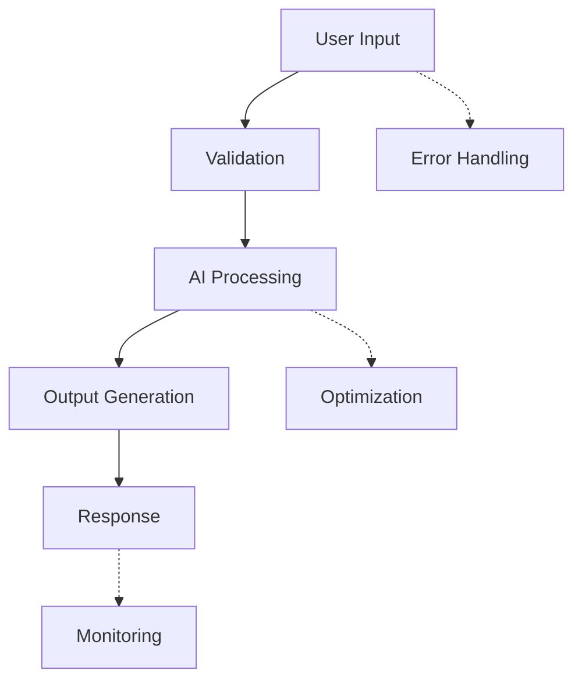

# Doctorate Programs Evaluator - Project Documentation

## Project Overview
This is a web application for exploring and managing doctoral programs in Spanish and Portuguese universities, with a focus on chemical, biomedical, and related sciences. The application provides multiple views for data visualization, program rating, and analysis.

## Architecture Overview

### Frontend Structure
- **index.html**: Main HTML file with multiple view tabs (map, table, analysis, rating, ranking, admin)
- **script.js**: Core frontend logic handling map view, filters, and general functionality
- **calificar-view.js**: Manages the rating/qualification view with detailed criteria evaluation
- **table-view-improved.js**: Handles the table view with university-grouped display and pagination
- **styles.css**: All styling for the application

### Backend Structure
- **server.js**: Express.js server with MongoDB integration
- **Database**: MongoDB with a single collection `programas`

## Database Schema

### Collection: `programas`

```javascript
{
  "_id": ObjectId,
  "universidad": String,           // University name
  "ciudad": String,                // City name
  "programa": String,              // Program name
  "linea_investigacion": String,   // Research lines (multiline text)
  "url": String,                   // Program URL
  "status": String,                // "pendiente" | "considerando" | "interesado" | "aplicando" | "descartado"
  
  // Rating/Qualification
  "calificacion": {
    "valor": Number,              // 1-5 stars rating
    "fecha": String,              // ISO date string
    "comentario": String          // Optional comment
  },
  
  // IMPORTANT: Criteria ratings (1-5 scale each)
  "criterios": {
    "relevancia": Number,         // Personal relevance and thematic affinity (1-5)
    "claridad": Number,           // Clarity of research lines (1-5)
    "transparencia": Number,      // Transparency in information (1-5)
    "actividades": Number,        // Variety of training activities (1-5)
    "resultados": Number          // Transparency in results and quality (1-5)
  },
  
  // AI-enriched data
  "resumen": String,              // AI-generated summary
  "coords": {
    "lat": Number,
    "lon": Number
  },
  "stats": {
    "innovacion": Number,         // 1-10
    "interdisciplinariedad": Number, // 1-10
    "impacto": Number,            // 1-10
    "internacional": Number,       // 1-10
    "aplicabilidad": Number       // 1-10
  },
  "ciudad_metrics": {
    "costo_vida": Number,         // 1-10 (inverted scale: 10=cheap, 1=expensive)
    "costo_vida_comentario": String,
    "calidad_servicio_medico": Number,
    "calidad_servicio_medico_comentario": String,
    "calidad_transporte": Number,
    "calidad_transporte_comentario": String,
    "calidad_aire": Number,
    "calidad_aire_comentario": String,
    "distancia_a_madrid_km": Number,
    "distancia_a_lisboa_km": Number,
    "ciudad_referencia": String
  },
  "university_summary": String,
  "city_description": String,
  "university_description": String,
  "ultimo_enriquecimiento": String  // ISO date of last AI enrichment
}
```

## Component Responsibilities

### server.js (Backend API)
**Purpose**: Handles all database operations and serves the API

**Key Endpoints**:
- `GET /api/programas` - Get all programs (flat list)
- `GET /api/universidades` - Get programs grouped by university
- `GET /api/programas/:id` - Get specific program
- `PUT /api/programas/:id` - Update program (including criterios)
- `PUT /api/programas/:id/calificacion` - Update program rating
- `PATCH /api/programas/:id/status` - Update program status
- `POST /api/programas` - Add new program
- `DELETE /api/programas/:id` - Delete program
- `POST /api/enrich` - Enrich data with AI
- `GET /api/programas/:id/criterios` - Debug endpoint for criteria

### script.js (Main Frontend)
**Purpose**: Core application logic and map view

**Key Functions**:
- `fetchUniversidadesData()` - Loads grouped university data
- `initMap()` - Initializes Leaflet map with markers
- `updateRankings()` - Updates the ranking view
- `setupCalificarTab()` - Initializes the rating tab
- `populateTable()` - Populates the table view

**Data Structure**:
```javascript
universidadesData = {
  programas_doctorado: {
    universidades: [
      {
        nombre: "Universidad Name",
        ciudad: "City",
        coords: { lat, lon },
        programas: [
          {
            _id: "...",
            nombre: "Program Name",
            // ... all program fields
          }
        ]
      }
    ]
  }
}
```

### calificar-view.js (Rating View)
**Purpose**: Handles the detailed rating interface with criteria evaluation

**Key Functions**:
- `initializeCalificarView()` - Loads programs for rating
- `editProgram(programId)` - Opens edit modal with criteria dots
- `setupCriteriaDots(criterionName)` - Sets up 1-5 dot rating for each criterion
- `saveProgram()` - Saves all changes including criterios to database
- `updateRating(programId, rating)` - Updates star rating

**Important**: This component handles the 5 criteria fields that need to be properly saved.

### table-view-improved.js (Table View)
**Purpose**: Displays programs grouped by university with pagination

**Key Features**:
- University-level grouping with collapsible panels
- Pagination (5 universities per page)
- In-line editing capabilities
- Batch save functionality

## Data Flow

### 1. Initial Load
```
Browser → GET /api/universidades → MongoDB → Grouped Data → Frontend State
```

### 2. Rating Update with Criteria
```
User clicks criteria dots → calificar-view.js collects values → 
PUT /api/programas/:id with criterios object → MongoDB update
```

### 3. Data Grouping
- Backend groups programs by university in `/api/universidades`
- Frontend maintains this grouped structure in `universidadesData`
- Each view (map, table, analysis) uses this grouped data

## Best Practices for New Features

### 1. Adding New Database Fields
- Add field to schema documentation in this file
- Update server.js PUT endpoint to accept the field
- Add UI elements in appropriate view files
- Test data persistence end-to-end

### 2. Adding New Criteria
- Add to the `criterios` object in database schema
- Create UI elements in calificar-view.js following existing pattern
- Add setupCriteriaDots() call for new criterion
- Update save logic to include new field

### 3. Data Enrichment
- New enrichment fields should be added to the enrichment functions
- Update both individual and batch enrichment endpoints
- Add appropriate AI prompts for new data generation

## Common Issues and Solutions

### Issue: Criterios not saving to database
**Solution**: Ensure the PUT endpoint includes criterios in the update object:
```javascript
// In saveProgram() function
updateData.criterios = {
  relevancia: parseInt(relevancia),
  claridad: parseInt(claridad),
  transparencia: parseInt(transparencia),
  actividades: parseInt(actividades),
  resultados: parseInt(resultados)
};
```

### Issue: Understanding data grouping
**Key Points**:
- Programs are stored flat in MongoDB
- Grouping happens at the API level in `/api/universidades`
- Frontend maintains grouped structure for performance
- Each university contains array of its programs

## Detailed Component Documentation

### Frontend Components Breakdown

#### index.html Structure
- **Header**: Application title and description
- **Tab Navigation**: Switches between 6 main views (mapa, tabla, analisis, calificar, ranking, admin)
- **Filters Panel**: Global search and filtering controls
- **Content Areas**: Each tab has its own content div
- **Modals**: Edit modals for programs and universities

#### View Components

**1. Mapa View (Map)**
- **Files**: script.js (main logic)
- **Purpose**: Interactive map showing universities with markers
- **Key Features**: 
  - Leaflet.js integration
  - Clustered markers for better visualization
  - Click handlers to open university details

**2. Tabla View (Table)**
- **Files**: table-view-improved.js
- **Purpose**: Paginated table with university grouping
- **Key Features**:
  - Collapsible university panels
  - In-line editing of program fields
  - 5 universities per page
  - Batch save functionality

**3. Análisis View (Analysis)**
- **Files**: script.js
- **Purpose**: Statistical analysis and charts
- **Key Features**:
  - Radar charts for academic metrics
  - City quality metrics visualization
  - University comparison tools

**4. Calificar View (Rating)**
- **Files**: calificar-view.js
- **Purpose**: Detailed program rating and criteria evaluation
- **Key Features**:
  - 5-star rating system
  - 5 detailed criteria evaluation (1-5 scale each)
  - Filter by rating status
  - Export capabilities (JSON/CSV)

**5. Ranking View**
- **Files**: script.js
- **Purpose**: Display ranked programs by rating
- **Key Features**:
  - Sortable ranking table
  - Top statistics
  - Distribution charts

**6. Admin View**
- **Files**: script.js
- **Purpose**: AI data enrichment and administration
- **Key Features**:
  - Bulk AI enrichment
  - Geographic data correction
  - Progress tracking

### API Endpoints Documentation

#### Core Program Endpoints
```javascript
// Get all programs (flat list)
GET /api/programas
// Returns: Array of program objects with all fields

// Get programs grouped by university  
GET /api/universidades
// Returns: { programas_doctorado: { universidades: [...] } }

// Get specific program
GET /api/programas/:id
// Returns: Single program object

// Update program (including criterios)
PUT /api/programas/:id
// Body: Any program fields to update
// Handles: status, url, linea_investigacion, calificacion, criterios

// Update only rating
PUT /api/programas/:id/calificacion
// Body: { calificacion: { valor, fecha, comentario } }

// Update only status
PATCH /api/programas/:id/status
// Body: { status: "pendiente|considerando|interesado|aplicando|descartado" }
```

#### Utility Endpoints
```javascript
// Search with filters
GET /api/busqueda?texto=...&universidad=...&ciudad=...
// Returns: Filtered programs grouped by university

// Analysis data
GET /api/analysis
// Returns: University stats for charts

// Debug endpoint for criterios
GET /api/programas/:id/criterios
// Returns: { programa_id, nombre, criterios, tiene_criterios }

// AI enrichment
POST /api/enrich
// Body: { options: { resumen, metrics, ciudad } }
```

### Data Transformation Flow

#### University Grouping Process
1. **Database Storage**: Programs stored flat with university/city fields
2. **API Aggregation**: `/api/universidades` groups by university+city combination
3. **Frontend State**: Maintains grouped structure in `universidadesData`
4. **View Rendering**: Each view uses the grouped data structure

#### Criterios Evaluation Flow
1. **UI Interaction**: User clicks criteria dots (1-5 scale)
2. **DOM Updates**: Hidden inputs store values, dots show visual state
3. **Save Process**: `saveProgram()` collects all criteria values
4. **API Request**: PUT request with criterios object
5. **Database Storage**: MongoDB stores criterios as nested object
6. **Data Reload**: Views refresh to show updated criteria

### State Management Patterns

#### Global State Variables
```javascript
// In script.js
let universidadesData = { programas_doctorado: { universidades: [] } };
let analysisData = { universidades: [] };

// In calificar-view.js  
let allPrograms = [];
let programStats = { totalCount: 0, universityCount: 0, statusCounts: [] };
```

#### Data Synchronization
- **Initial Load**: All views load from `/api/universidades` 
- **Updates**: Individual views may reload specific data
- **Consistency**: No shared state management - each view responsible for its data

### Error Handling Patterns

#### Frontend Error Handling
```javascript
try {
  const response = await fetch(url);
  if (!response.ok) throw new Error(`HTTP error! status: ${response.status}`);
  // Process data
} catch (error) {
  console.error('Error description:', error);
  alert(`User-friendly message: ${error.message}`);
}
```

#### Backend Error Handling
```javascript
try {
  // Database operations
  res.json(result);
} catch (error) {
  console.error('Error description:', error);
  res.status(500).json({ message: 'User-friendly message', error: error.message });
}
```

## Development Commands

```bash
# Start development server
npm run dev

# Start production server
npm start

# Run data enrichment
node utils/data-enricher.js enrich

# Create database backup
node utils/mongo-backup.js backup programas

# Import initial data
node import-data.js
```

## Testing Criterios Storage

To test if criterios are being stored correctly:

1. Open browser DevTools Network tab
2. Edit a program and set all 5 criteria values
3. Save the program
4. Check the PUT request payload - should include criterios object
5. Use the debug endpoint: GET `/api/programas/:id/criterios`

## Environment Variables

```env
MONGODB_URI=mongodb://localhost:27017/doctorados
OPENAI_API_KEY=your-api-key-here
JWT_SECRET=your-secret-here
PORT=3000
```

---

# 🎓 Slidev Best Practices for Educational Presentations

## 🎯 Overview
This section documents advanced best practices for creating pedagogically effective technical presentations using Slidev, specifically optimized for the Claude Code Development Course.

## 🧩 1. Animation Best Practices

### When to Use Animations
- **Progressive Disclosure**: Reveal complex concepts step-by-step to manage cognitive load
- **Code Explanations**: Highlight specific lines or sections during technical discussions
- **Concept Building**: Layer related ideas to build understanding incrementally
- **Attention Management**: Guide learner focus to key points without overwhelming

### v-click Usage Patterns

#### Sequential Reveals (Most Common)
```markdown
<v-clicks>

- **First concept** - Foundation knowledge
- **Second concept** - Builds on first
- **Third concept** - Integration point
- **Fourth concept** - Advanced application

</v-clicks>
```

#### Specific Click Timing
```markdown
<div v-click="1" class="concept-foundation">
Basic concept appears first
</div>

<div v-click="3" class="concept-advanced">
Advanced concept appears third (skipping click 2)
</div>

<div v-click="2" class="concept-bridge">
Bridge concept appears second
</div>
```

#### Hide After Reveal
```markdown
<div v-click.hide="2" class="temporary-hint">
Shows on click 1, hides on click 2
</div>
```

### Code Animation Techniques

#### Line-by-Line Code Reveals
```markdown
```javascript {1-3|5-10|12-15|all}
// Step 1: Setup and imports
const express = require('express');
const app = express();

// Step 2: Middleware configuration
app.use(express.json());
app.use(cors());
app.use(helmet());

// Step 3: Route definition
app.get('/api/data', async (req, res) => {
  const data = await fetchData();
  res.json(data);
});
```
```

#### Focus Highlighting
```markdown
```javascript {2,5-7}
const processData = async (input) => {
  const validated = validateInput(input); // Highlight this line
  
  try {
    const result = await aiProcessing(validated);  // Highlight this block
    const optimized = optimize(result);
    return optimized;
  } catch (error) {
    handleError(error);
  }
};
```
```

### Performance Considerations
- **Lightweight Animations**: Use CSS transforms over position changes
- **Reduce Motion**: Respect `prefers-reduced-motion` accessibility setting
- **Mobile Optimization**: Test on lower-end devices
- **Network Efficiency**: Minimize animation assets

```css
/* Accessibility-friendly animations */
@media (prefers-reduced-motion: reduce) {
  * {
    animation-duration: 0.01ms !important;
    animation-iteration-count: 1 !important;
    transition-duration: 0.01ms !important;
  }
}
```

## ✍️ 2. Annotations & Highlights

### Code Annotation System

#### Inline Highlights
```markdown
```javascript
// AI-generated function
const processUser = (user) => {
  const { name, email, preferences } = user; // [!code highlight]
  return {
    displayName: name.toUpperCase(),
    contact: email.toLowerCase(),
    settings: { ...preferences, theme: 'light' } // [!code focus]
  };
};
```
```

#### Line-Specific Annotations
```markdown
```javascript
const apiClient = {
  async getData() {
    const response = await fetch('/api/data'); // [!code warning]
    return response.json(); // [!code error]
  }
}
```
```

### Visual Callout System

#### Educational Callouts
```markdown
<div class="learning-tip">
💡 **AI Insight**: This pattern is commonly suggested by Claude Code for error handling
</div>

<div class="warning-callout">
⚠️ **Security Alert**: Always validate user input before processing
</div>

<div class="best-practice">
✅ **Best Practice**: Use destructuring for cleaner code and better performance
</div>
```

#### Interactive Annotations
```markdown
<div v-click="1" class="code-explanation">
<h4>Step 1: Validation</h4>
The input validation ensures data integrity before processing.
</div>

<div v-click="2" class="code-explanation">
<h4>Step 2: Processing</h4>
AI analyzes the validated data and suggests optimizations.
</div>
```

### Diagram Annotations with Mermaid

#### Progressive Diagram Reveals
```markdown


<div v-click="1" class="diagram-note">
<h4>Core Flow</h4>
Basic request-response pattern with validation and AI processing.
</div>

<div v-click="2" class="diagram-note">
<h4>Enhanced Features</h4>
Production-ready additions: error handling, optimization, and monitoring.
</div>
```

## 🛠️ 3. Advanced Slidev Functions & Vue Integration

### Code Walkthrough Components

#### Interactive Code Explorer
```vue
<template>
  <div class="code-walkthrough">
    <div class="code-section">
      <pre v-highlight="activeLines"><code>{{ codeExample }}</code></pre>
    </div>
    <div class="explanation-section">
      <div v-for="(step, index) in steps" :key="index" 
           v-show="currentStep === index" 
           class="step-explanation">
        <h3>{{ step.title }}</h3>
        <p>{{ step.description }}</p>
      </div>
    </div>
    <div class="controls">
      <button @click="previousStep" :disabled="currentStep === 0">Previous</button>
      <button @click="nextStep" :disabled="currentStep === steps.length - 1">Next</button>
    </div>
  </div>
</template>
```

#### Live Code Editor Integration
```markdown
<CodeEditor 
  language="javascript"
  :initial-code="initialJSCode"
  :ai-suggestions="true"
  theme="vs-light"
  @code-change="handleCodeChange"
/>
```

### Real-time Quiz Components

#### Formative Assessment Widget
```vue
<template>
  <div class="quiz-widget">
    <h3>{{ question.title }}</h3>
    <div class="question-content">
      <p>{{ question.text }}</p>
      <div v-if="question.type === 'multiple-choice'" class="options">
        <label v-for="(option, index) in question.options" :key="index">
          <input type="radio" :value="option.value" v-model="selectedAnswer">
          {{ option.text }}
        </label>
      </div>
      <div v-if="question.type === 'code'" class="code-question">
        <CodeEditor 
          :initial-code="question.starterCode"
          @code-submit="handleCodeSubmit"
        />
      </div>
    </div>
    <button @click="checkAnswer" :disabled="!selectedAnswer">Check Answer</button>
    <div v-if="showFeedback" class="feedback" :class="feedbackClass">
      {{ feedback }}
    </div>
  </div>
</template>
```

### Interactive Diagrams with Motion

#### Animated Architecture Diagram
```markdown
<div class="architecture-demo">
  <div v-motion
    :initial="{ x: -200, opacity: 0 }"
    :enter="{ x: 0, opacity: 1 }"
    :duration="800"
    v-click="1"
    class="component frontend">
    Frontend (React/Vue)
  </div>
  
  <div v-motion
    :initial="{ y: -100, opacity: 0 }"
    :enter="{ y: 0, opacity: 1 }"
    :duration="800"
    v-click="2"
    class="component api">
    API Layer (Express)
  </div>
  
  <div v-motion
    :initial="{ x: 200, opacity: 0 }"
    :enter="{ x: 0, opacity: 1 }"
    :duration="800"
    v-click="3"
    class="component database">
    Database (MongoDB)
  </div>
</div>
```

### Custom Teaching Components

#### Progress Tracker
```vue
<template>
  <div class="learning-progress">
    <h4>Module Progress</h4>
    <div class="progress-bar">
      <div class="progress-fill" :style="{ width: progressPercentage + '%' }"></div>
    </div>
    <div class="milestones">
      <div v-for="milestone in milestones" 
           :key="milestone.id"
           :class="['milestone', { completed: milestone.completed }]">
        {{ milestone.name }}
      </div>
    </div>
  </div>
</template>
```

## 🎓 4. Pedagogical Best Practices

### Cognitive Load Management

#### Information Chunking
```markdown
---
layout: center
---

# Complex Topic Breakdown

<div class="concept-chunks">
  <div v-click="1" class="chunk foundation">
    <h3>🔑 Foundation Concept</h3>
    <p>Essential knowledge that enables understanding</p>
  </div>
  
  <div v-click="2" class="chunk building">
    <h3>🧱 Building Block</h3>
    <p>Intermediate concept that connects foundation to application</p>
  </div>
  
  <div v-click="3" class="chunk application">
    <h3>🚀 Real Application</h3>
    <p>Practical implementation combining all concepts</p>
  </div>
</div>
```

#### Progressive Complexity
```markdown
<!-- Slide 1: Simple Example -->
```javascript
// Basic function
const greet = (name) => `Hello, ${name}!`;
```

<!-- Slide 2: Enhanced Version -->
```javascript
// Enhanced with validation
const greet = (name = 'Guest') => {
  if (typeof name !== 'string') return 'Hello, Guest!';
  return `Hello, ${name.trim()}!`;
};
```

<!-- Slide 3: Production Ready -->
```javascript
// Production-ready with AI suggestions
const greet = (name = 'Guest', options = {}) => {
  const { language = 'en', formal = false } = options;
  const sanitizedName = sanitizeInput(name);
  
  return generateGreeting(sanitizedName, { language, formal });
};
```
```

### Gagné's Nine Events Integration

#### Template Structure
```markdown
---
# 1. Gain Attention
layout: cover
background: /images/attention-grabbing.jpg
---

# 🚨 Real-World Problem
## How AI Code Generation Goes Wrong

---
# 2. Inform Learning Objectives
layout: center
---

# Learning Objectives 🎯

<v-clicks>

- **Identify** common AI code generation pitfalls
- **Apply** validation strategies for AI-generated code  
- **Evaluate** code quality using systematic criteria
- **Create** robust AI-assisted development workflows

</v-clicks>

---
# 3. Stimulate Prior Knowledge
layout: two-cols
---

# What You Already Know

::left::

## Programming Experience
- Function creation and usage
- Basic debugging techniques
- Code review concepts

::right::

## AI Tool Exposure
<v-clicks>

- ChatGPT or similar tools
- Code completion features
- Automated suggestions

</v-clicks>

---
# 4. Present Content
layout: default
---

# Core Content: AI Code Validation

<div class="content-progression">
  <div v-click="1" class="content-block">
    <h3>🔍 Understanding AI Limitations</h3>
    <!-- Detailed content -->
  </div>
  
  <div v-click="2" class="content-block">
    <h3>✅ Validation Strategies</h3>
    <!-- Practical techniques -->
  </div>
</div>

---
# 5. Provide Learning Guidance
layout: center
---

# 🧭 Step-by-Step Process

<div class="guidance-steps">
  <div v-click="1" class="step">
    <span class="step-number">1</span>
    <h4>Generate Code with AI</h4>
    <p>Use specific prompts and context</p>
  </div>
  
  <div v-click="2" class="step">
    <span class="step-number">2</span>
    <h4>Apply Validation Checklist</h4>
    <p>Systematic quality assessment</p>
  </div>
</div>

---
# 6. Elicit Performance
layout: center
---

# 🛠️ Hands-On Practice

<div class="practice-challenge">
  <h2>Challenge: Debug AI-Generated Code</h2>
  <p>Time: 15 minutes | Format: Individual then pairs</p>
  
  <CodeEditor 
    :initial-code="buggyAICode"
    :validation-enabled="true"
    @solution-found="handleSolutionFound"
  />
</div>

---
# 7. Provide Feedback
layout: default
---

# 📊 Your Progress

<div class="feedback-section">
  <div v-if="practiceCompleted" class="success-feedback">
    ✅ Excellent work! You identified {{ correctFindings }} out of {{ totalIssues }} issues.
  </div>
  
  <div class="improvement-areas">
    <h3>Areas for Enhancement:</h3>
    <ul>
      <li v-for="area in improvementAreas" :key="area">{{ area }}</li>
    </ul>
  </div>
</div>

---
# 8. Assess Performance
layout: center
---

# 🎯 Knowledge Check

<QuizComponent 
  :questions="moduleQuestions"
  :passing-score="80"
  @quiz-completed="handleQuizCompletion"
/>

---
# 9. Enhance Retention
layout: center
---

# 🔄 Transfer to Real Projects

<div class="retention-activities">
  <div v-click="1" class="activity">
    <h3>📝 Action Plan</h3>
    <p>Apply these techniques to your current projects</p>
  </div>
  
  <div v-click="2" class="activity">
    <h3>🤝 Peer Teaching</h3>
    <p>Explain the process to a colleague</p>
  </div>
  
  <div v-click="3" class="activity">
    <h3>📚 Further Learning</h3>
    <p>Explore advanced validation tools and techniques</p>
  </div>
</div>
```

### Visual Hierarchy Principles

#### Consistent Typography Scale
```css
/* Typography system for educational content */
.slide-title { font-size: 2.5rem; font-weight: 700; }
.section-title { font-size: 2rem; font-weight: 600; }
.subsection-title { font-size: 1.5rem; font-weight: 500; }
.body-text { font-size: 1rem; line-height: 1.6; }
.caption-text { font-size: 0.875rem; font-style: italic; }
```

#### Color-Coded Content Types
```css
/* Educational content color system */
.concept-foundation { border-left: 4px solid #3b82f6; background: #eff6ff; }
.concept-application { border-left: 4px solid #10b981; background: #ecfdf5; }
.warning-content { border-left: 4px solid #f59e0b; background: #fffbeb; }
.error-content { border-left: 4px solid #ef4444; background: #fef2f2; }
.success-content { border-left: 4px solid #22c55e; background: #f0fdf4; }
```

## 🎨 5. Light Theme Configuration

### Recommended Light Themes

#### Clean Professional Theme
```yaml
---
theme: default
colorSchema: light
fonts:
  sans: 'Inter, system-ui, sans-serif'
  mono: 'JetBrains Mono, Fira Code, monospace'
highlighter: shiki
lineNumbers: true
---
```

#### Educational Optimized Theme
```yaml
---
theme: apple-basic
colorSchema: light
class: text-left
drawings:
  persist: false
transition: slide-left
layout: cover
background: '#f8fafc'
---
```

### Custom Educational CSS

#### Light Theme Overrides
```css
:root {
  /* Light theme color palette */
  --slidev-theme-primary: #2563eb;
  --slidev-theme-accent: #7c3aed;
  --slidev-theme-background: #ffffff;
  --slidev-theme-foreground: #1e293b;
  --slidev-theme-muted: #64748b;
  
  /* Educational specific colors */
  --color-learning-tip: #eff6ff;
  --color-warning: #fef3c7;
  --color-error: #fee2e2;
  --color-success: #d1fae5;
  --color-code-highlight: #f1f5f9;
}

/* High contrast for accessibility */
.slidev-layout {
  background: var(--slidev-theme-background);
  color: var(--slidev-theme-foreground);
}

/* Code blocks optimized for light theme */
.shiki {
  background: var(--color-code-highlight) !important;
  border: 1px solid #e2e8f0;
  border-radius: 8px;
  padding: 1rem;
  font-size: 0.9rem;
  line-height: 1.5;
}

/* Educational component styling */
.learning-objective {
  background: linear-gradient(135deg, #eff6ff 0%, #dbeafe 100%);
  border: 1px solid #3b82f6;
  border-radius: 12px;
  padding: 1.5rem;
  margin: 1rem 0;
}

.code-challenge {
  background: linear-gradient(135deg, #fef3c7 0%, #fde68a 100%);
  border: 1px solid #f59e0b;
  border-radius: 12px;
  padding: 1.5rem;
  margin: 1rem 0;
}

.interactive-element {
  background: #ffffff;
  border: 2px solid #e5e7eb;
  border-radius: 8px;
  padding: 1rem;
  box-shadow: 0 1px 3px rgba(0, 0, 0, 0.1);
  transition: all 0.2s ease;
}

.interactive-element:hover {
  border-color: var(--slidev-theme-primary);
  box-shadow: 0 4px 12px rgba(37, 99, 235, 0.15);
}
```

#### Responsive Design
```css
/* Mobile optimization */
@media (max-width: 768px) {
  .slide-content {
    padding: 1rem;
    font-size: 0.9rem;
  }
  
  .two-column-layout {
    flex-direction: column;
  }
  
  .code-block {
    font-size: 0.8rem;
    overflow-x: auto;
  }
}

/* Print optimization */
@media print {
  .slidev-layout {
    background: white !important;
    color: black !important;
  }
  
  .interactive-element {
    border: 1px solid #000;
    background: white;
  }
}
```

## 🚀 6. Performance & Accessibility

### Performance Optimization
```javascript
// Lazy loading for heavy components
const HeavyComponent = defineAsyncComponent(() => import('./HeavyComponent.vue'));

// Image optimization
const optimizedImages = {
  sizes: '(max-width: 768px) 100vw, 50vw',
  loading: 'lazy',
  decoding: 'async'
};
```

### Accessibility Features
```css
/* Focus management */
.focusable:focus {
  outline: 2px solid var(--slidev-theme-primary);
  outline-offset: 2px;
}

/* Screen reader support */
.sr-only {
  position: absolute;
  width: 1px;
  height: 1px;
  padding: 0;
  margin: -1px;
  overflow: hidden;
  clip: rect(0, 0, 0, 0);
  border: 0;
}

/* High contrast mode support */
@media (prefers-contrast: high) {
  .interactive-element {
    border-width: 3px;
    border-color: #000;
  }
}
```

This comprehensive guide provides everything needed to create pedagogically effective, visually appealing, and technically robust educational presentations using Slidev.