<style>
:root {
  --slidev-theme-primary: #2563eb;
  --slidev-theme-accent: #7c3aed;
  --slidev-theme-background: #ffffff;
  --slidev-theme-foreground: #1e293b;
  --slidev-theme-muted: #64748b;
  --color-learning-tip: #eff6ff;
  --color-warning: #fef3c7;
  --color-error: #fee2e2;
  --color-success: #d1fae5;
  --color-code-highlight: #f1f5f9;
}

.learning-objective {
  background: linear-gradient(135deg, #eff6ff 0%, #dbeafe 100%);
  border: 1px solid #3b82f6;
  border-radius: 12px;
  padding: 1.5rem;
  margin: 1rem 0;
}

.code-challenge {
  background: linear-gradient(135deg, #fef3c7 0%, #fde68a 100%);
  border: 1px solid #f59e0b;
  border-radius: 12px;
  padding: 1.5rem;
  margin: 1rem 0;
}

.ai-insight {
  background: linear-gradient(135deg, #f0f9ff 0%, #e0f2fe 100%);
  border-left: 4px solid #0284c7;
  border-radius: 8px;
  padding: 1rem;
  margin: 1rem 0;
}

.best-practice {
  background: linear-gradient(135deg, #f0fdf4 0%, #dcfce7 100%);
  border-left: 4px solid #16a34a;
  border-radius: 8px;
  padding: 1rem;
  margin: 1rem 0;
}

.warning-callout {
  background: linear-gradient(135deg, #fffbeb 0%, #fef3c7 100%);
  border-left: 4px solid #d97706;
  border-radius: 8px;
  padding: 1rem;
  margin: 1rem 0;
}

.concept-foundation {
  background: linear-gradient(135deg, #eff6ff 0%, #dbeafe 100%);
  border-left: 4px solid #3b82f6;
  border-radius: 8px;
  padding: 1rem;
  margin: 1rem 0;
}

.concept-application {
  background: linear-gradient(135deg, #ecfdf5 0%, #d1fae5 100%);
  border-left: 4px solid #10b981;
  border-radius: 8px;
  padding: 1rem;
  margin: 1rem 0;
}

.interactive-element {
  background: #ffffff;
  border: 2px solid #e5e7eb;
  border-radius: 8px;
  padding: 1rem;
  box-shadow: 0 1px 3px rgba(0, 0, 0, 0.1);
  transition: all 0.2s ease;
}

.interactive-element:hover {
  border-color: var(--slidev-theme-primary);
  box-shadow: 0 4px 12px rgba(37, 99, 235, 0.15);
}

.progress-indicator {
  display: flex;
  align-items: center;
  gap: 0.5rem;
  font-size: 0.875rem;
  color: var(--slidev-theme-muted);
}

.progress-bar {
  width: 100px;
  height: 4px;
  background: #e5e7eb;
  border-radius: 2px;
  overflow: hidden;
}

.progress-fill {
  height: 100%;
  background: var(--slidev-theme-primary);
  transition: width 0.3s ease;
}

/* Force bold text rendering */
strong, .font-bold, **text** {
  font-weight: 700 !important;
  color: inherit;
}

/* Ensure proper markdown rendering */
.slidev-layout p strong {
  font-weight: 700 !important;
}

@media (prefers-reduced-motion: reduce) {
  * {
    animation-duration: 0.01ms !important;
    animation-iteration-count: 1 !important;
    transition-duration: 0.01ms !important;
  }
}
</style>

# M1 - AI/LLM Fundamentals
## Building with Claude Code

Module 1: Foundation for AI-Assisted Development

<div class="pt-12">
  <span @click="$slidev.nav.next" class="px-2 py-1 rounded cursor-pointer hover:bg-white hover:bg-opacity-10">
    Press Space to start <carbon:arrow-right class="inline"/>
  </span>
</div>

<div class="progress-indicator fixed bottom-4 right-4">
  <span>Module 1 of 10</span>
  <div class="progress-bar">
    <div class="progress-fill" style="width: 10%"></div>
  </div>
</div>

---
layout: section
---

# 🚨 Real-World Problem
## When AI Code Generation Goes Wrong

<div class="ai-insight">
<carbon:warning-alt class="text-orange-500 text-xl inline mr-2" />
Without proper understanding, AI assistance becomes AI dependency
</div>

---
layout: two-cols
---

# The AI Development Revolution

::left::

## Traditional Approach 😤

<v-clicks>

- Hours researching documentation and StackOverflow
- Manual coding from scratch with trial and error
- Isolated problem-solving and debugging
- Inconsistent code quality and patterns
- Limited learning from mistakes

</v-clicks>

<div v-click class="warning-callout">
<carbon:warning /> <strong>Result</strong>: Slow, frustrating development cycles with high cognitive load
</div>

::right::

## AI-Enhanced Development ✨

<v-clicks>

- <strong>Intelligent collaboration</strong> with AI for rapid problem-solving
- <strong>Guided learning</strong> with best practices built-in
- <strong>Real-time code review</strong> and optimization suggestions
- <strong>Comprehensive documentation</strong> generation automatically
- <strong>Pattern recognition</strong> for consistent, high-quality code

</v-clicks>

<div v-click class="best-practice">
<carbon:checkmark /> <strong>Result</strong>: 3-5x faster development with superior code quality
</div>

---
layout: center
---

# Learning Objectives 🎯

<div class="learning-objective">

## By the end of this module, you will achieve:

<v-clicks>

- <strong>90% Confidence</strong> in AI-assisted development workflows
- <strong>Master Claude Code</strong> interface and advanced features including Plan Mode
- <strong>Write Effective Prompts</strong> that consistently generate high-quality solutions
- <strong>Use Multimodal Input</strong> for enhanced development capabilities
- <strong>Evaluate AI Code</strong> for quality, security, and maintainability

</v-clicks>

</div>

<div v-click class="interactive-element text-center">
💡 <strong>Success Metric</strong>: Transform from traditional programmer to AI-enhanced developer
</div>

---
layout: two-cols
---

# What You Already Know

::left::

## Programming Foundation

<v-clicks>

- <strong>Function creation</strong> and basic programming concepts
- <strong>Debugging techniques</strong> and problem-solving approaches
- <strong>Code review</strong> fundamentals and quality awareness
- <strong>Version control</strong> basics with Git

</v-clicks>

::right::

## AI Tool Exposure

<v-clicks>

- <strong>ChatGPT or similar</strong> conversational AI tools
- <strong>Code completion</strong> features in modern editors
- <strong>Automated suggestions</strong> and basic AI assistance
- <strong>Search-driven</strong> development workflows

</v-clicks>

<div v-click class="concept-foundation">
<carbon:idea /> <strong>Foundation</strong>: Your existing skills + AI amplification = Professional development mastery
</div>

---
layout: default
---

# What Are Large Language Models? 🧠

<div class="grid grid-cols-2 gap-8">

<div>

## The Technology Behind Claude Code

<v-clicks>

- <strong>Massive Scale Training</strong> on diverse text and code datasets
- <strong>Pattern Recognition</strong> across programming languages and paradigms
- <strong>Context Understanding</strong> maintaining conversation continuity
- <strong>Natural Language Interface</strong> - no special syntax required
- <strong>Code Generation</strong> producing functional, documented solutions

</v-clicks>

</div>

<div v-click>

## AI Development Capabilities


</div>

</div>

<div v-click class="ai-insight">
<carbon:lightbulb class="text-blue-500 text-xl inline mr-2" />
<strong>Key Insight</strong>: LLMs excel at pattern recognition but require human judgment for business logic and domain expertise
</div>

---
layout: center
---

# Claude Code: Your AI Development Partner 🤖

<div class="grid grid-cols-2 gap-8 mt-8">

<div class="interactive-element">

## Core Features
<v-clicks>

- <strong>💬 Natural Conversation</strong> - Discuss code like with a colleague
- <strong>📋 Plan Mode</strong> - Systematic project breakdown and architecture
- <strong>🖼️ Multimodal Input</strong> - Images, documents, screenshots, and code
- <strong>📁 Project Context</strong> - Understands your entire codebase
- <strong>⚡ Code Execution</strong> - Test and validate solutions in real-time

</v-clicks>

</div>

<div class="interactive-element" v-click>

## Advanced Capabilities

<v-clicks>

- <strong>🧠 Contextual Awareness</strong> - Remembers project scope and decisions
- <strong>🏗️ Architecture Guidance</strong> - System design and best practices
- <strong>🔒 Security Consciousness</strong> - Built-in security best practices
- <strong>📚 Auto-Documentation</strong> - Comprehensive code documentation
- <strong>🚀 Performance Optimization</strong> - Efficiency improvements and suggestions

</v-clicks>

</div>

</div>

<div v-click class="code-challenge text-center">
<carbon:play class="text-amber-600 text-xl inline mr-2" />
<strong>Live Demo</strong>: Let's explore Claude Code's interface and capabilities together!
</div>

---
layout: default
---

# The Art of Prompt Engineering 🎨

<div class="space-y-6">

## Effective Prompts Have Four Essential Elements

<v-clicks>

<div class="concept-foundation">
<h3>1. 🎯 Clear Context</h3>
<p>What project are you working on? What's the current state?</p>
</div>

<div class="concept-foundation">
<h3>2. 🎯 Specific Goals</h3>
<p>What exactly do you want to achieve? What's the desired outcome?</p>
</div>

<div class="concept-foundation">
<h3>3. 📋 Relevant Details</h3>
<p>Constraints, requirements, technology stack, performance needs</p>
</div>

<div class="concept-foundation">
<h3>4. 📊 Expected Format</h3>
<p>How should the response be structured? Code, explanation, steps?</p>
</div>

</v-clicks>

</div>

---
layout: two-cols
---

# Prompt Quality: Bad vs Good Examples

::left::

## ❌ Ineffective Prompts

<v-clicks>

```markdown
"Make a website"
```

```markdown
"Fix my code"
```

```markdown
"Help with JavaScript"
```

</v-clicks>

<div v-click class="warning-callout">
<carbon:warning /> <strong>Problems</strong>: Too vague, no context, unclear goals, missing constraints
</div>

::right::

## ✅ Effective Prompts

<v-clicks>

```markdown
"Help me create a responsive portfolio website 
for a UX designer using HTML, CSS, and JavaScript. 
Include:
- Hero section with animated intro
- Portfolio grid with hover effects
- Contact form with validation
- Mobile-first design approach
- Fast loading times (<3s)
- Accessibility compliance (WCAG 2.1)"
```

</v-clicks>

<div v-click class="best-practice">
<carbon:checkmark /> <strong>Why Better</strong>: Specific scope, clear requirements, technical constraints, quality criteria
</div>

---
layout: default
---

# Advanced Prompting Techniques 🎯

<div class="space-y-6">

## Professional Prompt Patterns

<v-clicks>

<div class="grid grid-cols-2 gap-6">

<div class="interactive-element">
<h3>🎭 Role-Based Prompting</h3>
<pre class="text-sm"><code>"As a senior full-stack developer with 10 years 
experience, help me architect a scalable 
e-commerce platform..."</code></pre>
</div>

<div class="interactive-element">
<h3>📝 Step-by-Step Instructions</h3>
<pre class="text-sm"><code>"First, analyze the requirements
Then, design the database schema
Next, create the API endpoints
Finally, implement error handling"</code></pre>
</div>

<div class="interactive-element">
<h3>🔒 Constraint-Driven Approach</h3>
<pre class="text-sm"><code>"Using only vanilla JavaScript (no frameworks),
create a solution that works in IE11+
with a bundle size under 50KB"</code></pre>
</div>

<div class="interactive-element">
<h3>🧩 Example-Driven Development</h3>
<pre class="text-sm"><code>"Similar to Stripe's payment flow,
but adapted for subscription billing
with custom pricing tiers"</code></pre>
</div>

</div>

</v-clicks>

</div>

<div v-click class="ai-insight">
<carbon:idea class="text-blue-500 text-xl inline mr-2" />
<strong>Pro Tip</strong>: Combine multiple patterns for maximum effectiveness. Start with role + constraints + examples + step-by-step format.
</div>

---
layout: center
---

# 🛠️ Interactive Exercise: Master Prompt Engineering

<div class="code-challenge">

## Your Challenge: Create the Perfect Prompt

<strong>Scenario</strong>: You need to build a real-time collaborative document editor<br>
<strong>Your Task</strong>: Write a comprehensive prompt that will generate a professional solution

<strong>Consider These Elements</strong>:
<div class="grid grid-cols-4 gap-4 mt-4">

<div v-click class="text-center">
<div class="text-2xl">🎯</div>
<strong>Context & Goals</strong><br>
What specifically do you need?
</div>

<div v-click class="text-center">
<div class="text-2xl">🛠️</div>
<strong>Tech Stack</strong><br>
Technologies and constraints
</div>

<div v-click class="text-center">
<div class="text-2xl">⚡</div>
<strong>Performance</strong><br>
Speed and scalability needs
</div>

<div v-click class="text-center">
<div class="text-2xl">📋</div>
<strong>Format</strong><br>
How should response be structured?
</div>

</div>

</div>

<div v-click class="interactive-element text-center">
⏱️ <strong>Time</strong>: 10 minutes | 👥 <strong>Format</strong>: Individual then share best examples
</div>

---
layout: default
---

# Plan Mode: Your Project Architect 📋

<div class="grid grid-cols-2 gap-8">

<div>

## When to Use Plan Mode

<v-clicks>

- <strong>Complex, multi-step projects</strong> requiring systematic approach
- <strong>Unfamiliar technologies</strong> where you need guided learning
- <strong>Team collaboration</strong> requiring clear communication
- <strong>Architecture decisions</strong> needing structured thinking
- <strong>Learning new concepts</strong> step-by-step

</v-clicks>

<div v-click class="concept-application">
<carbon:lightbulb class="text-green-500 text-xl inline mr-2" />
<strong>Perfect for</strong>: "How do I even start?" moments in development
</div>

</div>

<div>

## Plan Mode Process Flow

```mermaid {scale: 0.8}
graph TD
    A[Complex Problem] --> B["🤔 Plan Mode Request"]
    B --> C["🔍 Problem Analysis"]
    C --> D["🏗️ Solution Architecture"]
    D --> E["📋 Step-by-Step Breakdown"]
    E --> F["🎯 Implementation Guidance"]
    F --> G["✅ Validation Strategy"]
    G --> H["🚀 Actionable Plan"]
    
    style A fill:#fef3c7
    style H fill:#d1fae5
    style D fill:#eff6ff
```

<v-clicks>



</v-clicks>

</div>

</div>

<div v-click class="code-challenge text-center">
<carbon:play class="text-amber-600 text-xl inline mr-2" />
<strong>Live Demo</strong>: Planning a full-stack web application with Claude Code
</div>

---
layout: section
---

# Multimodal Development 🎭
## Beyond Just Code

---
layout: two-cols
---

# Modern Development Involves Multiple Assets

::left::

## Traditional Development Assets
<v-clicks>

- <strong>📝 Text Requirements</strong> - Written specifications and docs
- <strong>🎨 Visual Design</strong> - UI mockups and wireframes  
- <strong>📊 Architecture Diagrams</strong> - System design visuals
- <strong>📸 Screenshots</strong> - Bug reports and UI references
- <strong>📄 Documentation</strong> - API docs and guides

</v-clicks>

::right::

## Claude Code's Multimodal Magic

<v-clicks>

- <strong>📷 Image Analysis</strong> → Generate corresponding functional code
- <strong>📄 Document Processing</strong> → Extract and implement requirements
- <strong>🎨 Design Translation</strong> → Convert mockups to working components
- <strong>📊 Diagram Understanding</strong> → Build systems from architectural diagrams
- <strong>🔍 Screenshot Debugging</strong> → Identify and fix UI issues

</v-clicks>

<div v-click class="best-practice">
<carbon:idea class="text-green-500 text-xl inline mr-2" />
<strong>Real Example</strong>: Upload a UI mockup → Get complete React components with responsive CSS!
</div>

---
layout: default
---

# Multimodal Workflow Examples 🌟

<div class="space-y-6">

## Practical Multimodal Development Scenarios

<v-clicks>

<div class="grid grid-cols-2 gap-6">

<div class="interactive-element">
<h3>🎨 Design to Code</h3>
<p><strong>Input</strong>: Figma design screenshot</p>
<p><strong>Output</strong>: Complete React component with styled-components</p>
<p><strong>Benefit</strong>: 80% faster UI implementation</p>
</div>

<div class="interactive-element">
<h3>📊 Architecture Implementation</h3>
<p><strong>Input</strong>: System architecture diagram</p>
<p><strong>Output</strong>: Microservices structure with Docker config</p>
<p><strong>Benefit</strong>: Consistent system implementation</p>
</div>

<div class="interactive-element">
<h3>🐛 Visual Bug Fixing</h3>
<p><strong>Input</strong>: Screenshot of broken UI</p>
<p><strong>Output</strong>: CSS fixes and responsive improvements</p>
<p><strong>Benefit</strong>: Rapid debugging and resolution</p>
</div>

<div class="interactive-element">
<h3>📋 Requirements to Features</h3>
<p><strong>Input</strong>: PDF specification document</p>
<p><strong>Output</strong>: Complete feature implementation</p>
<p><strong>Benefit</strong>: Direct spec-to-code translation</p>
</div>

</div>

</v-clicks>

</div>

<div v-click class="ai-insight">
<carbon:lightbulb class="text-blue-500 text-xl inline mr-2" />
<strong>Pro Workflow</strong>: Combine multiple inputs (design + requirements + existing code) for comprehensive solutions
</div>

---
layout: default
---

# Code Quality and AI Partnership 🏆

<div class="grid grid-cols-2 gap-8">

<div>

## AI-Generated Code Strengths

<v-clicks>

- ✅ <strong>Current best practices</strong> automatically applied
- ✅ <strong>Comprehensive error handling</strong> built-in
- ✅ <strong>Well-structured architecture</strong> following patterns
- ✅ <strong>Complete documentation</strong> with examples
- ✅ <strong>Security-conscious</strong> implementation by default
- ✅ <strong>Performance optimization</strong> considerations included

</v-clicks>

</div>

<div>

## Areas Requiring Human Expertise

<v-clicks>

- 🧠 <strong>Business logic validation</strong> and domain knowledge
- 🔒 <strong>Security vulnerability assessment</strong> in context
- ⚡ <strong>Performance optimization</strong> for specific use cases
- 🔗 <strong>Integration complexity</strong> with existing systems
- 🎯 <strong>User experience</strong> considerations and usability
- 📊 <strong>Data modeling</strong> and business rules

</v-clicks>

</div>

</div>

<div v-click class="concept-application text-center">
<span class="text-2xl font-bold">🏆 Golden Rule: AI amplifies your capabilities—it doesn't replace your judgment</span>
</div>

<div v-click class="ai-insight">
<carbon:partnership class="text-blue-500 text-xl inline mr-2" />
<strong>Partnership Model</strong>: AI handles patterns and boilerplate, humans handle creativity and domain expertise
</div>

---
layout: center
---

# 💻 Hands-On Practice: First AI Prompt

<div class="code-challenge">

## Your Challenge: Create a Prompt for a Calculator

<strong>Goal</strong>: Write a comprehensive prompt to create a functional calculator using HTML, CSS, and JavaScript

<strong>Requirements to Consider</strong>:
<div class="grid grid-cols-2 gap-6 mt-4">

<div>
<h4><strong>Functionality</strong></h4>
<ul>
<li>Basic arithmetic operations</li>
<li>Clear and reset functions</li>
<li>Decimal number support</li>
<li>Error handling</li>
</ul>
</div>

<div>
<h4><strong>Design & UX</strong></h4>
<ul>
<li>Responsive design</li>
<li>Keyboard support</li>
<li>Visual feedback</li>
<li>Accessibility features</li>
</ul>
</div>

</div>

</div>

<div class="mt-8 grid grid-cols-3 gap-4">

<div v-click class="text-center">
<div class="text-2xl">🎯</div>
<strong>Context</strong><br>
What type of calculator?
</div>

<div v-click class="text-center">
<div class="text-2xl">🎨</div>
<strong>Styling</strong><br>
Visual preferences?
</div>

<div v-click class="text-center">
<div class="text-2xl">⚙️</div>
<strong>Features</strong><br>
What operations?
</div>

</div>

<div v-click class="interactive-element text-center">
⏱️ <strong>Time</strong>: 8 minutes | 👥 <strong>Format</strong>: Individual work then peer review
</div>

---
layout: default
---

# Creative AI Development Workflows 🎨

<div class="space-y-6">

## Beyond Traditional Coding Patterns

<v-clicks>

<div class="grid grid-cols-2 gap-6">

<div class="interactive-element">
<h3>🚀 Rapid Prototyping</h3>
<p>Quick concept validation and iterative development</p>
<ul class="text-sm mt-2">
<li>MVP development in hours</li>
<li>Feature testing and validation</li>
<li>Stakeholder demonstrations</li>
</ul>
</div>

<div class="interactive-element">
<h3>🧭 Technology Exploration</h3>
<p>Learning new frameworks and tools efficiently</p>
<ul class="text-sm mt-2">
<li>Guided framework tutorials</li>
<li>Best practice implementation</li>
<li>Common pitfall avoidance</li>
</ul>
</div>

<div class="interactive-element">
<h3>🧩 Problem Decomposition</h3>
<p>Breaking complex challenges into manageable pieces</p>
<ul class="text-sm mt-2">
<li>System architecture planning</li>
<li>Feature prioritization</li>
<li>Implementation roadmaps</li>
</ul>
</div>

<div class="interactive-element">
<h3>📚 Documentation Generation</h3>
<p>Comprehensive project documentation automatically</p>
<ul class="text-sm mt-2">
<li>API documentation</li>
<li>Code comments and explanations</li>
<li>User guides and tutorials</li>
</ul>
</div>

</div>

</v-clicks>

</div>

<div v-click class="concept-application">
<carbon:idea class="text-green-500 text-xl inline mr-2" />
<strong>Advanced Pattern</strong>: Chain multiple AI workflows together for complete feature development lifecycle
</div>

---
layout: center
---

# Example: Complete AI Development Workflow

<div class="space-y-6">

<v-clicks>

<div class="grid grid-cols-4 gap-4">

<div class="interactive-element text-center">
<div class="text-3xl mb-2">1️⃣</div>
<h4><strong>Problem Analysis</strong></h4>
<p class="text-sm">Describe challenge to AI → Get multiple solution approaches with pros/cons</p>
</div>

<div class="interactive-element text-center">
<div class="text-3xl mb-2">2️⃣</div>
<h4><strong>Architecture Planning</strong></h4>
<p class="text-sm">Choose approach → Get detailed implementation plan with best practices</p>
</div>

<div class="interactive-element text-center">
<div class="text-3xl mb-2">3️⃣</div>
<h4><strong>Implementation</strong></h4>
<p class="text-sm">Code with AI assistance → Real-time review and optimization suggestions</p>
</div>

<div class="interactive-element text-center">
<div class="text-3xl mb-2">4️⃣</div>
<h4><strong>Quality Assurance</strong></h4>
<p class="text-sm">Generate tests and docs → Complete professional-grade solution</p>
</div>

</div>

</v-clicks>

<div v-click class="best-practice text-center">
<carbon:trophy class="text-green-500 text-xl inline mr-2" />
<strong>Result</strong>: Professional development speed with enterprise-quality output
</div>

</div>

---
layout: section
---

# Ethical AI Development 🤔
## Building Responsibly

---
layout: default
---

# Best Practices for Ethical AI Development

<div class="grid grid-cols-2 gap-8">

<div>

## Core Ethical Principles

<v-clicks>

- <strong>🏷️ Transparency</strong>: Acknowledge AI assistance when appropriate
- <strong>📚 Learning Enhancement</strong>: Use AI to enhance, not replace, learning
- <strong>✅ Verification</strong>: Always validate and test AI-generated solutions
- <strong>🔒 Privacy Protection</strong>: Be mindful of sensitive data in prompts
- <strong>🤝 Collaboration</strong>: Share knowledge and effective practices

</v-clicks>

</div>

<div>

## Implementation Guidelines

<v-clicks>

- <strong>📋 Code Review</strong>: Understand every line before implementation
- <strong>🧪 Comprehensive Testing</strong>: Especially security and edge cases
- <strong>📖 Continuous Learning</strong>: Maintain and develop fundamental skills
- <strong>👥 Knowledge Sharing</strong>: Help others learn effective AI collaboration
- <strong>🔄 Iterative Improvement</strong>: Refine prompts and workflows continuously

</v-clicks>

</div>

</div>

<div v-click class="concept-application">
<span class="font-bold">💡 Remember</span>: AI is a powerful tool that enhances human creativity and problem-solving—use it to become a better developer, not to replace your thinking
</div>

---
layout: default
---

# Common Pitfalls and Smart Solutions ⚠️

<div class="space-y-6">

<v-clicks>

<div class="grid grid-cols-2 gap-6">

<div class="warning-callout">
<h3>❌ Over-reliance Pattern</h3>
<p><strong>Problem</strong>: Using AI for every small task, losing manual coding skills</p>
<p><strong>Solution</strong>: Balance AI assistance with hands-on practice. Reserve AI for complex problems.</p>
</div>

<div class="best-practice">
<h3>✅ Strategic AI Usage</h3>
<p><strong>Approach</strong>: Use AI for architecture, boilerplate, and complex logic. Code simple functions manually.</p>
</div>

<div class="warning-callout">
<h3>❌ Vague Communication</h3>
<p><strong>Problem</strong>: Incomplete or vague prompts leading to inadequate solutions</p>
<p><strong>Solution</strong>: Develop systematic prompt engineering skills with templates.</p>
</div>

<div class="best-practice">
<h3>✅ Structured Prompting</h3>
<p><strong>Approach</strong>: Use consistent prompt patterns: context + goals + constraints + format.</p>
</div>

<div class="warning-callout">
<h3>❌ Blind Implementation</h3>
<p><strong>Problem</strong>: Not reviewing or understanding AI-generated code</p>
<p><strong>Solution</strong>: Develop systematic code review and validation processes.</p>
</div>

<div class="best-practice">
<h3>✅ Quality Assurance</h3>
<p><strong>Approach</strong>: Always review, test, and understand before implementing AI solutions.</p>
</div>

</div>

</v-clicks>

</div>

---
layout: center
---

# 🛠️ Practice Session: Building with AI

<div class="code-challenge">

## Guided Exercise: Complete Todo Application

<strong>What we'll build</strong>: Interactive todo list with data persistence and modern UI<br>
<strong>How we'll build it</strong>: Step-by-step with Claude Code collaboration<br>
<strong>What you'll learn</strong>: Complete AI-assisted development workflow

<div class="mt-8 grid grid-cols-4 gap-4">

<div v-click class="text-center">
<div class="text-2xl">📝</div>
<strong>HTML Structure</strong><br>
Semantic, accessible markup
</div>

<div v-click class="text-center">
<div class="text-2xl">🎨</div>
<strong>CSS Styling</strong><br>
Modern, responsive design
</div>

<div v-click class="text-center">
<div class="text-2xl">⚡</div>
<strong>JavaScript Logic</strong><br>
Interactive features & state
</div>

<div v-click class="text-center">
<div class="text-2xl">💾</div>
<strong>Data Persistence</strong><br>
Local storage integration
</div>

</div>

</div>

<div v-click class="interactive-element text-center">
⏱️ <strong>Time</strong>: 25 minutes | 🤖 <strong>Method</strong>: Follow-along coding with AI assistance
</div>

---
layout: default
---

# Real-World Application Examples 🌍

<div class="space-y-8">

<div v-click>
<h2 class="text-xl font-bold mb-4">Case Study 1: E-commerce Feature Development</h2>
<div class="grid grid-cols-3 gap-4 text-sm">
<div class="interactive-element">
<strong>Challenge:</strong> Add shopping cart with real-time updates
</div>
<div class="interactive-element">
<strong>AI Approach:</strong> Plan mode → Implementation → Testing → Documentation
</div>
<div class="interactive-element">
<strong>Result:</strong> Complete feature in 3 hours vs. 12 hours traditional approach
</div>
</div>
</div>

<div v-click>
<h2 class="text-xl font-bold mb-4">Case Study 2: API Integration Project</h2>
<div class="grid grid-cols-3 gap-4 text-sm">
<div class="interactive-element">
<strong>Challenge:</strong> Integrate external payment service securely
</div>
<div class="interactive-element">
<strong>AI Approach:</strong> Security analysis → Code generation → Error handling
</div>
<div class="interactive-element">
<strong>Result:</strong> Secure, robust integration with comprehensive error handling
</div>
</div>
</div>

<div v-click>
<h2 class="text-xl font-bold mb-4">Case Study 3: Performance Optimization</h2>
<div class="grid grid-cols-3 gap-4 text-sm">
<div class="interactive-element">
<strong>Challenge:</strong> Slow database queries affecting user experience
</div>
<div class="interactive-element">
<strong>AI Approach:</strong> Problem analysis → Multiple solutions → Implementation comparison
</div>
<div class="interactive-element">
<strong>Result:</strong> 75% performance improvement with minimal code changes
</div>
</div>
</div>

</div>

<div v-click class="best-practice">
<carbon:trophy class="text-green-500 text-xl inline mr-2" />
<strong>Pattern</strong>: AI accelerates both development speed and solution quality across all project types
</div>

---
layout: default
---

# Measuring Your Progress 📈

<div class="grid grid-cols-2 gap-8">

<div>

## Success Indicators

<v-clicks>

- <strong>📝 Prompt Quality</strong>: Consistently receive relevant, actionable responses
- <strong>🔧 Feature Mastery</strong>: Comfortable with all Claude Code capabilities  
- <strong>🔍 Code Assessment</strong>: Can evaluate and improve AI-generated solutions
- <strong>🔄 Workflow Integration</strong>: Seamlessly blend AI into development process
- <strong>🎯 Quality Output</strong>: Produce professional-grade code efficiently

</v-clicks>

</div>

<div>

## Module 1 Assessment

<v-clicks>

- <strong>📝 Knowledge Quiz</strong>: 25 questions covering core concepts (80% to pass)
- <strong>💻 Practical Demo</strong>: Live AI-assisted development session
- <strong>📁 Prompt Portfolio</strong>: Collection of effective prompt examples
- <strong>🤝 Peer Review</strong>: Collaborative assessment activity
- <strong>🎯 Real Project</strong>: Apply skills to actual development challenge

</v-clicks>

</div>

</div>

<div v-click class="learning-objective text-center">
<span class="text-lg font-bold">🎯 Success Target: 80% assessment score + demonstrated AI collaboration competency</span>
</div>

---
layout: two-cols
---

# Looking Ahead: Your AI Development Journey

::left::

## Skills You've Built Today
<v-clicks>

- <strong>LLM Understanding</strong> - How AI development assistance works
- <strong>Prompt Engineering</strong> - Writing effective AI instructions
- <strong>Plan Mode Mastery</strong> - Systematic project breakdown
- <strong>Multimodal Development</strong> - Using images and documents
- <strong>Quality Assessment</strong> - Evaluating AI-generated solutions

</v-clicks>

::right::

## Next Steps in Your Journey

<v-clicks>

- <strong>📝 Complete Assessment</strong> - Demonstrate your new capabilities
- <strong>📁 Build Portfolio</strong> - Collection of AI-assisted solutions
- <strong>👥 Join Community</strong> - Share learnings and get support
- <strong>🏗️ Apply Skills</strong> - Use AI assistance in real projects
- <strong>📚 Prepare for Module 2</strong> - Development environment setup

</v-clicks>

<div v-click class="concept-application">
<carbon:rocket class="text-green-500 text-xl inline mr-2" />
<strong>Ready</strong>: You're now prepared for AI-enhanced development!
</div>

---
layout: section
---

# Module Summary & Next Steps 📚

---
layout: two-cols
---

# What You've Accomplished

::left::

## Core Knowledge Mastered
<v-clicks>

- <strong>AI/LLM Fundamentals</strong> and Claude Code capabilities
- <strong>Effective Prompting</strong> strategies and advanced techniques  
- <strong>Plan Mode Usage</strong> for complex project management
- <strong>Multimodal Development</strong> with images and documents
- <strong>Quality Assessment</strong> of AI-generated solutions

</v-clicks>

::right::

## Practical Skills Developed
<v-clicks>

- <strong>Navigate Claude Code</strong> interface confidently
- <strong>Write Professional Prompts</strong> that generate quality solutions
- <strong>Break Down Projects</strong> systematically using Plan Mode
- <strong>Evaluate Code Quality</strong> and implement improvements
- <strong>Integrate AI Assistance</strong> into daily development workflows

</v-clicks>

<div v-click class="best-practice">
<carbon:checkmark class="text-green-500 text-xl inline mr-2" />
<strong>Achievement Unlocked</strong>: AI-Enhanced Developer Status
</div>

---
layout: center
---

# Ready to Transform Your Development Process? 🚀

<div class="space-y-8">

<div class="text-2xl font-bold text-center">
Module 1 Assessment Available Now
</div>

<v-clicks>

<div class="grid grid-cols-3 gap-6">

<div class="interactive-element text-center">
<h3>📝 Knowledge Check</h3>
<p>25 questions covering all concepts</p>
<p class="text-sm text-gray-600">Target: 80% or higher</p>
</div>

<div class="interactive-element text-center">
<h3>💻 Practical Demo</h3>
<p>Live coding with AI assistance</p>
<p class="text-sm text-gray-600">Show your workflow mastery</p>
</div>

<div class="interactive-element text-center">
<h3>📁 Portfolio Creation</h3>
<p>Document effective prompts</p>
<p class="text-sm text-gray-600">Build your AI toolkit</p>
</div>

</div>

<div class="text-center">
<span class="text-6xl">⬇️</span>
</div>

<div class="text-xl text-center">
<strong>Next:</strong> Module 2 - Foundations<br>
<em>Setting up your AI-enhanced development environment</em>
</div>

</v-clicks>

</div>

---
layout: center
---

# Questions & Discussion 🤔

<div class="interactive-element">

## Let's Discuss Your Learning

<div class="grid grid-cols-2 gap-8 mt-8">

<div>
<h3>🎯 Key Insights</h3>
<ul>
<li>What surprised you about AI development?</li>
<li>Which Claude Code feature excites you most?</li>
<li>How will this change your workflow?</li>
</ul>
</div>

<div>
<h3>🚀 Next Applications</h3>
<ul>
<li>What project will you try AI assistance with first?</li>
<li>Which prompting technique will be most useful?</li>
<li>What concerns do you have about AI development?</li>
</ul>
</div>

</div>

</div>

<div class="mt-8 text-center p-6 bg-gradient-to-r from-blue-500 to-purple-600 text-white rounded-lg">
<span class="text-2xl font-bold">Ready to revolutionize your development process?</span>
</div>

---
layout: end
---

# Congratulations! 🎉

## You've mastered AI/LLM fundamentals

Continue your AI-enhanced development journey with <strong>Module 2: Foundations</strong>

<div class="mt-8 text-center">
<p class="text-lg">Transform your development process.</p>
<p class="text-lg">Build better software faster.</p>
<p class="text-lg font-bold">Welcome to the future of programming.</p>
</div>