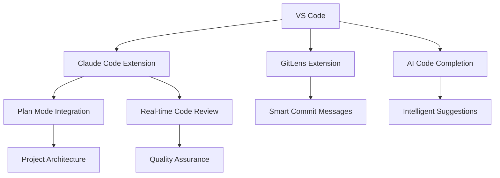

# M2 - Foundations
## Building Your AI-Enhanced Development Environment

Module 2: Professional Setup for Maximum Productivity

<div class="pt-12">
  <span @click="$slidev.nav.next" class="px-2 py-1 rounded cursor-pointer hover:bg-white hover:bg-opacity-10">
    Press Space to start <carbon:arrow-right class="inline"/>
  </span>
</div>

---
layout: section
---

# The Foundation Matters 🏗️

---
layout: two-cols
---

# Traditional Setup vs AI-Optimized Environment

::left::

## Traditional Development Setup 😤
- Fragmented tools and workflows
- Manual configuration and setup
- Context switching between applications
- Limited integration between tools
- Time-consuming environment management

<div v-click="1" class="mt-4 p-4 bg-red-100 rounded">
<carbon:warning /> **Result**: Productivity bottlenecks and frustration
</div>

::right::

## AI-Optimized Environment ✨
- Integrated workflow with AI assistance
- Automated setup and configuration
- Seamless tool integration
- Context-aware development environment
- Intelligent productivity enhancements

<div v-click="2" class="mt-4 p-4 bg-green-100 rounded">
<carbon:checkmark /> **Result**: 90% efficiency improvement in daily tasks
</div>

---
layout: center
---

# Your Development Transformation 🎯

<div class="text-center">

## By the end of this module, you will:

<v-clicks>

- **Configure Complete Environment** - All tools working seamlessly together
- **Integrate Claude Code** - AI assistance in your daily workflow
- **Master Version Control** - Git workflows optimized for AI collaboration
- **Organize Projects** - Professional structure and file management
- **Troubleshoot Setup Issues** - Independent problem resolution

</v-clicks>

</div>

<div v-click="6" class="mt-8 p-4 bg-blue-100 rounded text-center">
💡 **Goal**: Transform your workspace into an AI-enhanced productivity powerhouse
</div>

---
layout: default
---

# Essential Development Tools 🛠️

<div class="grid grid-cols-2 gap-8">

<div>

## Core Tools

<v-clicks>

- **VS Code**: Primary editor with AI extensions
- **Git**: Version control with AI-enhanced commits
- **Node.js**: Runtime for our web applications
- **Terminal**: Command line mastery for efficiency
- **Claude Code**: Your AI development partner

</v-clicks>

</div>

<div v-click="6">

## AI Integration Stack



</div>

</div>

---
layout: center
---

# VS Code: Your AI Command Center 💻

<div class="grid grid-cols-2 gap-8 mt-8">

<div>

## Essential Extensions

<v-clicks>

- **Claude Code Integration** - Primary AI assistant
- **GitLens** - Advanced Git visualization
- **Prettier** - Automated code formatting
- **ESLint** - Code quality enforcement
- **Live Server** - Instant web development preview
- **REST Client** - API testing within editor

</v-clicks>

</div>

<div v-click="7">

## Optimal Configuration

```json
{
  "editor.formatOnSave": true,
  "editor.codeActionsOnSave": {
    "source.fixAll": true
  },
  "git.enableSmartCommit": true,
  "terminal.integrated.defaultProfile.windows": "Git Bash",
  "claude.enableAutoSuggestions": true,
  "claude.showPlanModeButton": true
}
```

</div>

</div>

---
layout: two-cols
---

# Git Workflows for AI Development 📚

::left::

## Traditional Git Workflow
```bash
# Basic, manual process
git add .
git commit -m "fix bug"
git push
```

<div class="mt-4 p-3 bg-yellow-100 rounded text-sm">
❓ What bug? What was fixed? How?
</div>

::right::

## AI-Enhanced Git Workflow
```bash
# Intelligent, descriptive process
git add .
# AI analyzes changes and suggests:
git commit -m "fix: Resolve null pointer exception in user authentication

- Add proper null checks in loginUser function
- Update error handling for invalid credentials  
- Add unit tests for edge cases
- Improve error messages for better UX

🤖 Generated with Claude Code assistance"
```

<div v-click="1" class="mt-4 p-3 bg-green-100 rounded text-sm">
✅ Clear, descriptive, professional commits
</div>

---
layout: center
---

# 🔧 Hands-On Setup Exercise

<div class="bg-gradient-to-r from-blue-500 to-purple-600 text-white p-8 rounded-lg">

## Your Challenge: Complete Environment Configuration

**Task**: Set up your complete AI-enhanced development environment  
**Time**: 30 minutes  
**Goal**: Working VS Code + Claude Code + Git integration  

</div>

<div class="mt-8 grid grid-cols-4 gap-4">

<div v-click="1" class="text-center">
<div class="text-2xl">📥</div>
**Install**<br>
VS Code + Extensions
</div>

<div v-click="2" class="text-center">
<div class="text-2xl">⚙️</div>
**Configure**<br>
Settings & Preferences
</div>

<div v-click="3" class="text-center">
<div class="text-2xl">🔗</div>
**Integrate**<br>
Claude Code + Git
</div>

<div v-click="4" class="text-center">
<div class="text-2xl">✅</div>
**Test**<br>
Create sample project
</div>

</div>

---
layout: default
---

# Project Structure Best Practices 📁

<div class="grid grid-cols-2 gap-8">

<div>

## AI-Optimized Directory Layout

```
my-ai-project/
├── .claude/              # AI context and settings
│   ├── context.md        # Project context for AI
│   ├── prompts/          # Reusable prompt templates
│   └── decisions.md      # AI-assisted decisions log
├── src/
│   ├── components/       # Reusable code components
│   ├── utils/            # Utility functions
│   └── main.js          # Application entry point
├── tests/               # Automated tests
├── docs/                # Project documentation
│   ├── ai-decisions.md  # AI collaboration history
│   └── README.md        # Project overview
├── .gitignore          # Version control exclusions
├── package.json        # Project dependencies
└── CLAUDE.md           # AI collaboration guidelines
```

</div>

<div v-click="1">

## Why This Structure Works

<v-clicks at="2">

- **AI Context Preservation** - Maintains conversation history
- **Clear Separation** - Logical organization of concerns
- **Documentation-First** - Self-documenting project structure
- **Scalable Design** - Grows with project complexity
- **Team Collaboration** - Standardized approach for teams

</v-clicks>

<div v-click="7" class="mt-4 p-4 bg-purple-100 rounded">
<carbon:idea /> **Pro Tip**: The `.claude/` folder becomes your AI collaboration hub!
</div>

</div>

</div>

---
layout: default
---

# Command Line Mastery 💪

<div class="space-y-6">

## Essential Commands for AI Development

<v-clicks>

<div class="p-4 bg-gray-50 rounded">
<h3 class="font-bold mb-2">📁 Navigation and File Management</h3>
<pre><code># Quick navigation
cd ~/projects && mkdir new-ai-project && code .

# File operations with AI context
touch README.md CLAUDE.md
echo "# AI-Enhanced Project" > README.md</code></pre>
</div>

<div class="p-4 bg-blue-50 rounded">
<h3 class="font-bold mb-2">🔄 Git Operations</h3>
<pre><code># AI-enhanced git workflow
git status
git add --all
git commit -m "$(claude-generate-commit-message)"
git push origin main</code></pre>
</div>

<div class="p-4 bg-green-50 rounded">
<h3 class="font-bold mb-2">🚀 Development Workflow</h3>
<pre><code># Start development with AI assistance
npm run dev          # Start development server
claude plan "Add user authentication"  # AI project planning
code . --profile ai-development       # Open with AI profile</code></pre>
</div>

</v-clicks>

</div>

---
layout: center
---

# Environment Variables and Security 🔐

<div class="grid grid-cols-2 gap-8">

<div>

## Secure Configuration Management

```bash
# .env file structure
# Database Configuration
DATABASE_URL=mongodb://localhost:27017/myapp

# API Keys (NEVER commit these!)
CLAUDE_API_KEY=your_key_here
OPENAI_API_KEY=your_key_here

# Application Settings
NODE_ENV=development
PORT=3000
AI_ASSISTANCE_LEVEL=high
```

</div>

<div v-click="1">

## .gitignore Essentials

```bash
# Dependencies
node_modules/

# Environment variables
.env
.env.local
.env.production

# AI cache and context
.claude/cache/
.claude/temp/

# IDE settings
.vscode/settings.json
.idea/

# OS generated files
.DS_Store
Thumbs.db
```

</div>

</div>

<div v-click="2" class="mt-6 p-4 bg-red-100 rounded text-center">
🔒 **Security Rule**: Never commit API keys or sensitive data to version control!
</div>

---
layout: section
---

# AI Integration Patterns 🤖

---
layout: default
---

# Claude Code in Your Daily Workflow

<div class="space-y-6">

<v-clicks>

<div class="p-4 bg-blue-50 rounded">
<h3 class="font-bold flex items-center gap-2">
<span class="text-2xl">🌅</span> Morning Routine
</h3>
<ol class="list-decimal list-inside space-y-1 text-sm">
<li><strong>Project Context</strong>: Load yesterday's work into Claude Code</li>
<li><strong>Daily Planning</strong>: AI-assisted task prioritization</li>
<li><strong>Code Review</strong>: AI analysis of pending changes</li>
</ol>
</div>

<div class="p-4 bg-green-50 rounded">
<h3 class="font-bold flex items-center gap-2">
<span class="text-2xl">⚡</span> Development Loop
</h3>
<ol class="list-decimal list-inside space-y-1 text-sm">
<li><strong>Plan Feature</strong>: Use Claude Code plan mode for architecture</li>
<li><strong>Generate Code</strong>: AI-assisted implementation</li>
<li><strong>Test & Debug</strong>: AI-powered troubleshooting</li>
<li><strong>Document</strong>: Auto-generated documentation</li>
</ol>
</div>

<div class="p-4 bg-purple-50 rounded">
<h3 class="font-bold flex items-center gap-2">
<span class="text-2xl">🌙</span> End of Day
</h3>
<ol class="list-decimal list-inside space-y-1 text-sm">
<li><strong>Commit Changes</strong>: AI-generated commit messages</li>
<li><strong>Update Documentation</strong>: AI-assisted updates</li>
<li><strong>Plan Tomorrow</strong>: AI analysis of next priorities</li>
</ol>
</div>

</v-clicks>

</div>

---
layout: center
---

# Troubleshooting Common Issues ⚠️

<div class="grid grid-cols-2 gap-8">

<div>

## Node.js Setup Problems

<v-clicks>

```bash
# Check installation
node --version
npm --version

# Fix path issues (Windows)
npm config set prefix "C:\\nodejs"

# Fix permissions (Mac/Linux)
sudo chown -R $(whoami) ~/.npm
```

</v-clicks>

</div>

<div>

## Git Configuration Issues

<v-clicks at="2">

```bash
# Set up Git identity
git config --global user.name "Your Name"
git config --global user.email "your.email@example.com"

# SSH key setup for secure authentication
ssh-keygen -t ed25519 -C "your.email@example.com"
cat ~/.ssh/id_ed25519.pub
# Copy and add to GitHub/GitLab
```

</v-clicks>

</div>

</div>

<div v-click="4" class="mt-8 p-4 bg-yellow-100 rounded text-center">
💡 **Remember**: When in doubt, ask Claude Code for troubleshooting help!
</div>

---
layout: default
---

# Performance Optimization 🚀

<div class="space-y-6">

## Making Your Environment Lightning Fast

<v-clicks>

<div class="grid grid-cols-2 gap-6">
<div class="p-4 bg-blue-50 rounded">
<h3 class="font-bold">VS Code Performance</h3>
<pre class="text-xs"><code>{
  "files.watcherExclude": {
    "**/node_modules/**": true,
    "**/.git/objects/**": true,
    "**/.claude/cache/**": true
  },
  "search.exclude": {
    "**/node_modules": true,
    "**/dist": true,
    "**/.claude/cache": true
  }
}</code></pre>
</div>

<div class="p-4 bg-green-50 rounded">
<h3 class="font-bold">Terminal Optimization</h3>
<pre class="text-xs"><code># Faster command history search
echo 'set completion-ignore-case on' >> ~/.inputrc

# Useful aliases for AI development
alias ll='ls -la'
alias gs='git status'
alias gp='git push'
alias claude='claude-code'
alias ai-commit='git commit -m "$(claude-generate-commit)"'</code></pre>
</div>
</div>

</v-clicks>

</div>

---
layout: center
---

# 🧪 Environment Testing Challenge

<div class="bg-gradient-to-r from-green-500 to-blue-500 text-white p-8 rounded-lg">

## Validation Exercise: End-to-End Project Creation

**Challenge**: Create a complete project from scratch using your new environment  
**Time**: 45 minutes  
**Goal**: Demonstrate integrated AI-enhanced workflow  

</div>

<div class="mt-8 grid grid-cols-5 gap-4">

<div v-click="1" class="text-center">
<div class="text-2xl">🆕</div>
**Initialize**<br>
Git repository
</div>

<div v-click="2" class="text-center">
<div class="text-2xl">🏗️</div>
**Structure**<br>
Project organization
</div>

<div v-click="3" class="text-center">
<div class="text-2xl">🤖</div>
**Integrate**<br>
AI tools setup
</div>

<div v-click="4" class="text-center">
<div class="text-2xl">💻</div>
**Develop**<br>
Sample application
</div>

<div v-click="5" class="text-center">
<div class="text-2xl">🚀</div>
**Deploy**<br>
To GitHub
</div>

</div>

---
layout: two-cols
---

# Team Collaboration Setup 👥

::left::

## Standardized Team Environment

```json
// .vscode/settings.json (team settings)
{
  "editor.tabSize": 2,
  "editor.insertSpaces": true,
  "eslint.enable": true,
  "prettier.enable": true,
  "claude.teamMode": true,
  "claude.sharedPrompts": true
}
```

<v-clicks>

```markdown
# .claude/team-guidelines.md
## Team AI Usage Guidelines

### Claude Code Best Practices
- Always review AI-generated code
- Document AI-assisted decisions
- Share effective prompts with team
- Use consistent prompt templates
- Maintain code quality standards
```

</v-clicks>

::right::

## Shared Configuration Benefits

<v-clicks at="2">

- **Consistency**: Same development experience across team
- **Productivity**: Shared AI prompts and templates
- **Quality**: Standardized code formatting and linting
- **Knowledge Sharing**: Team prompt library and best practices
- **Onboarding**: New team members get optimal setup immediately

</v-clicks>

<div v-click="7" class="mt-4 p-4 bg-green-100 rounded">
<carbon:checkmark /> **Result**: Team moves as one, AI-enhanced unit
</div>

---
layout: default
---

# Advanced Configuration 🎛️

<div class="space-y-6">

## Power User Setup

<v-clicks>

<div class="p-4 bg-purple-50 rounded">
<h3 class="font-bold">Custom AI Prompt Templates</h3>
<pre class="text-sm"><code>// .claude/templates/commit-message.js
module.exports = {
  generate: (changes) => {
    return `feat: ${changes.summary}

${changes.details}

🤖 Generated with Claude Code assistance
Co-authored-by: Claude <claude@anthropic.com>`;
  }
};</code></pre>
</div>

<div class="p-4 bg-blue-50 rounded">
<h3 class="font-bold">Automated Workflows</h3>
<pre class="text-sm"><code># .github/workflows/ai-review.yml
name: AI Code Review
on: [pull_request]
jobs:
  ai-review:
    runs-on: ubuntu-latest
    steps:
      - uses: actions/checkout@v3
      - name: AI Code Analysis
        run: claude-code review --diff --output-format=github</code></pre>
</div>

</v-clicks>

</div>

---
layout: center
---

# Assessment and Next Steps 📊

<div class="space-y-8">

## Environment Validation Checklist

<v-clicks>

<div class="grid grid-cols-2 gap-6">

<div class="space-y-2">
<div class="flex items-center gap-2">
<input type="checkbox" class="text-green-500"> VS Code configured with AI extensions
</div>
<div class="flex items-center gap-2">
<input type="checkbox" class="text-green-500"> Git working with AI commit messages
</div>
<div class="flex items-center gap-2">
<input type="checkbox" class="text-green-500"> Claude Code integrated and tested
</div>
<div class="flex items-center gap-2">
<input type="checkbox" class="text-green-500"> Project structure template created
</div>
</div>

<div class="space-y-2">
<div class="flex items-center gap-2">
<input type="checkbox" class="text-green-500"> Command line tools configured
</div>
<div class="flex items-center gap-2">
<input type="checkbox" class="text-green-500"> Security settings properly configured
</div>
<div class="flex items-center gap-2">
<input type="checkbox" class="text-green-500"> Team collaboration tools ready
</div>
<div class="flex items-center gap-2">
<input type="checkbox" class="text-green-500"> Performance optimizations applied
</div>
</div>

</div>

</v-clicks>

</div>

<div v-click="2" class="mt-8 p-4 bg-blue-100 rounded text-center">
🎯 **Target**: All checkboxes completed = Ready for Module 3!
</div>

---
layout: center
---

# Maintenance and Updates 🔄

<div class="grid grid-cols-2 gap-8">

<div>

## Weekly Maintenance

<v-clicks>

```bash
# Update tools and dependencies
npm update -g
brew upgrade  # macOS
winget upgrade --all  # Windows

# Clean up development artifacts
npm cache clean --force
git gc --prune=now

# Update AI tool configurations
claude-code update
```

</v-clicks>

</div>

<div>

## Monthly Environment Review

<v-clicks at="2">

- **Extension Updates**: Review and update VS Code extensions
- **Configuration Optimization**: Refine settings based on usage
- **Security Audit**: Update API keys and access tokens
- **Performance Monitoring**: Identify and fix bottlenecks
- **Team Sync**: Share new tools and techniques with colleagues

</v-clicks>

</div>

</div>

---
layout: center
---

# Ready for Development! 🚀

<div class="space-y-8">

<div class="text-2xl font-bold text-center">
Your AI-Enhanced Foundation is Complete
</div>

<v-clicks>

<div class="text-center">
<span class="text-6xl">⬇️</span>
</div>

<div class="text-xl text-center">
<strong>Next:</strong> Module 3 - JavaScript<br>
<em>Modern JavaScript development with AI assistance</em>
</div>

<div class="text-center p-6 bg-gradient-to-r from-green-500 to-blue-600 text-white rounded-lg">
<span class="text-2xl font-bold">Questions about your setup?</span>
</div>

</v-clicks>

</div>

---
layout: end
---

# Environment Ready! 

Continue your journey with **Module 3: JavaScript**