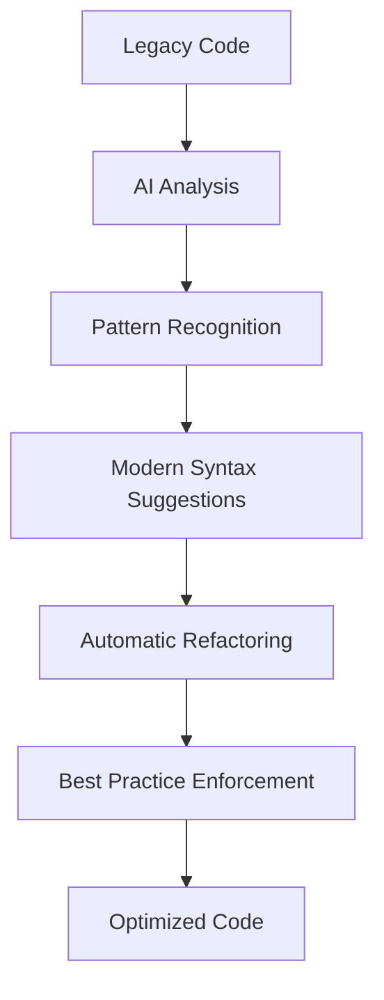

# M3 - Modern JavaScript
## AI-Assisted Development Mastery

Module 3: From Basics to Advanced with Claude Code

<div class="pt-12">
  <span @click="$slidev.nav.next" class="px-2 py-1 rounded cursor-pointer hover:bg-white hover:bg-opacity-10">
    Press Space to start <carbon:arrow-right class="inline"/>
  </span>
</div>

---
layout: section
---

# JavaScript Revolution 🚀

---
layout: two-cols
---

# Traditional vs AI-Enhanced JavaScript

::left::

## Traditional Development 😤
- Manual coding with trial and error
- Stack Overflow dependency for solutions
- Time-consuming debugging sessions
- Inconsistent code quality
- Limited pattern recognition

<div v-click="1" class="mt-4 p-4 bg-red-100 rounded">
<carbon:warning /> **Result**: Slow development cycles and technical debt
</div>

::right::

## AI-Enhanced Development ✨
- AI-guided implementation and best practices
- Instant code generation and optimization
- Intelligent debugging and error prevention
- Consistent high-quality code patterns
- Real-time learning and improvement

<div v-click="2" class="mt-4 p-4 bg-green-100 rounded">
<carbon:checkmark /> **Result**: 4x faster development with better quality
</div>

---
layout: center
---

# Your JavaScript Journey 🎯

<div class="text-center">

## By the end of this module, you will:

<v-clicks>

- **Master Modern JS Syntax** - ES6+ features with AI guidance
- **Handle Async Programming** - Promises, async/await with AI debugging  
- **Manipulate the DOM** - Interactive UIs with AI assistance
- **Debug Effectively** - AI-powered troubleshooting techniques
- **Write Clean Code** - Best practices automatically applied

</v-clicks>

</div>

<div v-click="6" class="mt-8 p-4 bg-blue-100 rounded text-center">
⏰ **Time Investment**: 10-12 hours over 2-3 weeks
</div>

---
layout: default
---

# ES6+ Features with AI 🆕

<div class="grid grid-cols-2 gap-8">

<div>

## Core Modern Features

<v-clicks>

- **Arrow Functions** - Concise syntax with lexical scope
- **Template Literals** - String interpolation and multiline
- **Destructuring** - Extract values from objects/arrays
- **Modules** - Import/export functionality
- **Classes** - Object-oriented programming syntax

</v-clicks>

</div>

<div v-click="6">

## AI Development Advantages



</div>

</div>

---
layout: two-cols
---

# Arrow Functions and AI ➡️

::left::

## Traditional Approach
```javascript
function greetUser(name) {
    return "Hello, " + name + "!";
}

function processData(items) {
    return items.map(function(item) {
        return item.name.toUpperCase();
    });
}
```

<div v-click="1" class="mt-4 p-3 bg-yellow-100 rounded text-sm">
⚠️ Verbose syntax, potential scope issues
</div>

::right::

## AI-Enhanced Modern Style
```javascript
const greetUser = (name = 'Guest') => `Hello, ${name}!`;

const processData = (items) => 
    items.map(item => item.name.toUpperCase());

// AI suggests even more improvements
const processUsers = (users = []) => 
    users
        .filter(Boolean)
        .map(({ name = 'Anonymous' }) => name.toUpperCase())
        .sort();
```

<div v-click="2" class="mt-4 p-3 bg-green-100 rounded text-sm">
✅ Concise, safe, and performant
</div>

---
layout: default
---

# Template Literals Power 💪

<div class="space-y-6">

## Basic String Interpolation

<v-clicks>

```javascript
// Old way
const message = "User " + user.name + " has " + user.points + " points";

// Modern way with AI optimization
const message = `User ${user.name} has ${user.points} points`;
```

</v-clicks>

<v-clicks at="2">

## AI-Generated Complex Templates

```javascript
const generateUserCard = (user) => `
  <div class="user-card ${user.isVip ? 'vip' : 'standard'}">
    <div class="user-header">
      
      <h3>${user.name}</h3>
    </div>
    <div class="user-details">
      <p>Status: ${user.isActive ? '✅ Active' : '❌ Inactive'}</p>
      <p>Member since: ${new Date(user.joinDate).getFullYear()}</p>
      <p>Points: ${user.points.toLocaleString()}</p>
    </div>
  </div>
`;
```

</v-clicks>

</div>

---
layout: center
---

# 🛠️ Hands-On Practice: Code Modernization

<div class="bg-gradient-to-r from-blue-500 to-purple-600 text-white p-8 rounded-lg">

## Refactoring Challenge

**Task**: Transform legacy JavaScript using modern syntax with AI assistance

**Starting Code**:
```javascript
function processUsers(users) {
    var result = [];
    for (var i = 0; i < users.length; i++) {
        if (users[i].active === true) {
            result.push({
                id: users[i].id,
                name: users[i].firstName + " " + users[i].lastName
            });
        }
    }
    return result;
}
```

</div>

<div class="mt-8 grid grid-cols-3 gap-4">

<div v-click="1" class="text-center">
<div class="text-2xl">🎯</div>
**Identify**<br>
Outdated patterns
</div>

<div v-click="2" class="text-center">
<div class="text-2xl">🤖</div>
**Apply AI**<br>
Modern techniques
</div>

<div v-click="3" class="text-center">
<div class="text-2xl">✨</div>
**Optimize**<br>
Performance & readability
</div>

</div>

<div v-click="4" class="mt-6 text-center">
⏱️ **Time**: 15 minutes | 👥 **Format**: Individual then peer review
</div>

---
layout: default
---

# Destructuring Mastery 📦

<div class="grid grid-cols-2 gap-8">

<div>

## Object Destructuring

<v-clicks>

```javascript
// Basic destructuring
const { name, email, age } = user;

// AI-suggested with defaults
const { 
  name = 'Anonymous', 
  email = 'no-email@example.com',
  preferences: { theme = 'light', language = 'en' } = {}
} = user;

// Dynamic property names
const field = 'username';
const { [field]: userValue } = data;
```

</v-clicks>

</div>

<div>

## Array Destructuring

<v-clicks at="4">

```javascript
// Basic patterns
const [first, second, ...rest] = items;

// Skip elements
const [, , third] = coordinates;

// Swapping variables
[a, b] = [b, a];

// Function parameters
const process = ({ name, type = 'default' }) => {
  return `Processing ${name} as ${type}`;
};
```

</v-clicks>

</div>

</div>

<div v-click="8" class="mt-6 p-4 bg-blue-100 rounded">
<carbon:lightbulb /> **AI Tip**: Destructuring improves code readability and reduces repetitive property access
</div>

---
layout: section
---

# Asynchronous JavaScript 🔄
## Mastering Modern Async Patterns

---
layout: two-cols
---

# Promise Evolution with AI

::left::

## Callback Hell (Old)
```javascript
getData(function(err, data) {
    if (err) throw err;
    processData(data, function(err, result) {
        if (err) throw err;
        saveData(result, function(err, saved) {
            if (err) throw err;
            console.log('Success!');
        });
    });
});
```

<div class="mt-4 p-3 bg-red-50 border border-red-200 rounded text-sm">
❌ Complex, error-prone, hard to maintain
</div>

::right::

## AI-Enhanced Async/Await
```javascript
const processWorkflow = async () => {
    try {
        const data = await getData();
        const result = await processData(data);
        const saved = await saveData(result);
        
        console.log('Success!', saved);
        return saved;
    } catch (error) {
        console.error('Workflow failed:', error);
        await logError(error);
        throw error;
    }
};
```

<div v-click="1" class="mt-4 p-3 bg-green-50 border border-green-200 rounded text-sm">
✅ Clean, readable, maintainable
</div>

---
layout: default
---

# Advanced Async Patterns 🚀

<div class="space-y-6">

## Parallel Processing with AI Optimization

<v-clicks>

```javascript
// Sequential (slow)
const results = [];
for (const id of userIds) {
    const user = await fetchUser(id);
    results.push(user);
}

// AI-suggested parallel processing
const users = await Promise.all(
    userIds.map(id => fetchUser(id))
);

// AI-enhanced with error resilience
const usersWithFallback = await Promise.allSettled(
    userIds.map(async (id) => {
        try {
            return await fetchUser(id);
        } catch (error) {
            return { id, error: error.message, fallback: true };
        }
    })
);
```

</v-clicks>

</div>

---
layout: default
---

# Error Handling Excellence 🛡️

<div class="space-y-6">

## AI-Enhanced Error Management

<v-clicks>

```javascript
const fetchUserData = async (userId, options = {}) => {
    const { retries = 3, timeout = 5000 } = options;
    
    for (let attempt = 1; attempt <= retries; attempt++) {
        try {
            const controller = new AbortController();
            const timeoutId = setTimeout(() => controller.abort(), timeout);
            
            const response = await fetch(`/api/users/${userId}`, {
                signal: controller.signal
            });
            
            clearTimeout(timeoutId);
            
            if (!response.ok) {
                throw new APIError(`HTTP ${response.status}: ${response.statusText}`);
            }
            
            return await response.json();
            
        } catch (error) {
            if (attempt === retries) {
                throw new UserFetchError(`Failed after ${retries} attempts: ${error.message}`);
            }
            
            // Exponential backoff
            await new Promise(resolve => 
                setTimeout(resolve, Math.pow(2, attempt) * 1000)
            );
        }
    }
};
```

</v-clicks>

</div>

---
layout: center
---

# 🎪 DOM Manipulation Mastery

<div class="bg-gradient-to-r from-green-500 to-blue-500 text-white p-8 rounded-lg">

## Interactive UI Development Challenge

**Goal**: Build a dynamic user interface with modern DOM techniques  
**Features**: Real-time updates, event delegation, performance optimization  
**AI Assistance**: Pattern recognition, optimization suggestions, best practices  

</div>

<div class="mt-8 grid grid-cols-4 gap-4">

<div v-click="1" class="text-center">
<div class="text-2xl">🎯</div>
**Select**<br>
Modern DOM methods
</div>

<div v-click="2" class="text-center">
<div class="text-2xl">⚡</div>
**Events**<br>
Delegation patterns
</div>

<div v-click="3" class="text-center">
<div class="text-2xl">🔄</div>
**Update**<br>
Efficient rendering
</div>

<div v-click="4" class="text-center">
<div class="text-2xl">🚀</div>
**Optimize**<br>
Performance monitoring
</div>

</div>

---
layout: default
---

# Modern DOM Techniques 🖱️

<div class="grid grid-cols-2 gap-8">

<div>

## AI-Enhanced Element Selection

<v-clicks>

```javascript
// Old approach
const button = document.getElementById('submit-btn');
const items = document.getElementsByClassName('item');

// Modern AI-suggested approach
const elements = {
    form: document.querySelector('#user-form'),
    submitBtn: document.querySelector('#submit-btn'),
    items: document.querySelectorAll('.item'),
    container: document.querySelector('[data-container]')
};

// Null-safe operations
elements.submitBtn?.addEventListener('click', handleSubmit);
```

</v-clicks>

</div>

<div>

## Event Delegation Patterns

<v-clicks at="2">

```javascript
// AI-generated event delegation
const container = document.querySelector('#app-container');

const eventHandlers = {
    'click': {
        '.todo-complete': (target, event) => {
            toggleTodoComplete(target.closest('.todo-item'));
        },
        '.todo-delete': (target, event) => {
            deleteTodoItem(target.closest('.todo-item'));
        },
        '.todo-edit': (target, event) => {
            editTodoItem(target.closest('.todo-item'));
        }
    }
};

container.addEventListener('click', (event) => {
    const handlers = eventHandlers.click;
    Object.entries(handlers).forEach(([selector, handler]) => {
        if (event.target.matches(selector)) {
            handler(event.target, event);
        }
    });
});
```

</v-clicks>

</div>

</div>

---
layout: default
---

# Performance Optimization 🚀

<div class="space-y-6">

## AI-Driven Performance Enhancement

<v-clicks>

```javascript
// Debouncing utility (AI-generated)
const debounce = (func, delay, immediate = false) => {
    let timeoutId;
    return function executedFunction(...args) {
        const callNow = immediate && !timeoutId;
        
        clearTimeout(timeoutId);
        timeoutId = setTimeout(() => {
            timeoutId = null;
            if (!immediate) func.apply(this, args);
        }, delay);
        
        if (callNow) func.apply(this, args);
    };
};

// Usage with search functionality
const searchInput = document.querySelector('#search');
const performSearch = debounce(async (query) => {
    if (query.length < 2) return;
    
    const results = await searchAPI(query);
    displayResults(results);
}, 300);

searchInput.addEventListener('input', (e) => {
    performSearch(e.target.value.trim());
});
```

</v-clicks>

</div>

---
layout: default
---

# Functional Programming Patterns 🔄

<div class="space-y-6">

## AI-Optimized Array Methods

<v-clicks>

```javascript
const users = [
    { name: 'Alice', age: 25, role: 'admin', active: true },
    { name: 'Bob', age: 30, role: 'user', active: false },
    { name: 'Charlie', age: 35, role: 'user', active: true }
];

// AI suggests optimal chaining and performance
const processUsers = (users, filters = {}) => {
    return users
        .filter(user => filters.active ? user.active : true)
        .filter(user => filters.minAge ? user.age >= filters.minAge : true)
        .map(user => ({
            id: user.id,
            displayName: user.name.toUpperCase(),
            isAdmin: user.role === 'admin',
            metadata: {
                age: user.age,
                accountAge: calculateAccountAge(user.createdAt)
            }
        }))
        .sort((a, b) => a.displayName.localeCompare(b.displayName));
};

// Usage with AI-suggested optimization
const activeAdults = processUsers(users, { active: true, minAge: 21 });
```

</v-clicks>

</div>

---
layout: center
---

# 🌍 Real-World Project: Dynamic Todo App

<div class="bg-gradient-to-r from-purple-500 to-pink-500 text-white p-8 rounded-lg">

## Complete Application Development

**Features to Implement**:
- Add/edit/delete todos with validation
- Real-time filtering and search
- Drag-and-drop reordering
- Local storage persistence with sync
- Responsive design with animations

**AI Assistance Areas**:
- Code generation and optimization
- Bug detection and automated fixes
- Performance improvements and monitoring
- Accessibility enhancements
- Security best practices implementation

</div>

<div class="mt-8 grid grid-cols-5 gap-4">

<div v-click="1" class="text-center">
<div class="text-2xl">🏗️</div>
**Architecture**<br>
Component design
</div>

<div v-click="2" class="text-center">
<div class="text-2xl">⚡</div>
**Implementation**<br>
Feature development
</div>

<div v-click="3" class="text-center">
<div class="text-2xl">🎨</div>
**Styling**<br>
UI/UX polish
</div>

<div v-click="4" class="text-center">
<div class="text-2xl">🧪</div>
**Testing**<br>
Quality assurance
</div>

<div v-click="5" class="text-center">
<div class="text-2xl">🚀</div>
**Deploy**<br>
Production ready
</div>

</div>

<div v-click="6" class="mt-6 text-center">
⏱️ **Time**: 45 minutes | 🤖 **AI Tools**: Claude Code for assistance
</div>

---
layout: default
---

# Module System Mastery 📦

<div class="grid grid-cols-2 gap-8">

<div>

## ES6 Modules Structure

<v-clicks>

```javascript
// utils/api.js
export const API_CONFIG = {
    baseURL: 'https://api.example.com',
    timeout: 5000,
    retries: 3
};

export const createApiClient = (config = API_CONFIG) => {
    return {
        async get(endpoint) {
            const response = await fetch(`${config.baseURL}${endpoint}`);
            if (!response.ok) throw new Error(`API Error: ${response.status}`);
            return response.json();
        },
        
        async post(endpoint, data) {
            const response = await fetch(`${config.baseURL}${endpoint}`, {
                method: 'POST',
                headers: { 'Content-Type': 'application/json' },
                body: JSON.stringify(data)
            });
            return response.json();
        }
    };
};

export default createApiClient;
```

</v-clicks>

</div>

<div>

## AI-Suggested Import Patterns

<v-clicks at="2">

```javascript
// main.js - AI optimizes imports
import ApiClient, { API_CONFIG, createApiClient } from './utils/api.js';
import { debounce, throttle, memoize } from './utils/performance.js';
import { validateEmail, sanitizeInput } from './utils/validation.js';

// Dynamic imports for code splitting (AI suggestion)
const loadChartLibrary = async () => {
    const { Chart } = await import('./libs/chart.js');
    return Chart;
};

// Conditional loading
if (shouldLoadAnalytics) {
    const analytics = await import('./utils/analytics.js');
    analytics.track('page_view');
}

// AI-suggested module organization
const modules = {
    api: createApiClient(),
    utils: { debounce, throttle, memoize },
    validation: { validateEmail, sanitizeInput }
};
```

</v-clicks>

</div>

</div>

---
layout: default
---

# Testing JavaScript with AI 🧪

<div class="space-y-6">

## Automated Test Generation

<v-clicks>

```javascript
// Original function
const calculateShippingCost = (weight, distance, express = false) => {
    if (weight <= 0 || distance <= 0) {
        throw new Error('Weight and distance must be positive');
    }
    
    const baseCost = weight * 0.5 + distance * 0.1;
    return express ? baseCost * 1.5 : baseCost;
};

// AI-generated comprehensive tests
describe('calculateShippingCost', () => {
    test('calculates standard shipping correctly', () => {
        expect(calculateShippingCost(10, 100)).toBe(15); // 10*0.5 + 100*0.1
    });
    
    test('applies express shipping multiplier', () => {
        expect(calculateShippingCost(10, 100, true)).toBe(22.5); // 15 * 1.5
    });
    
    test('throws error for invalid weight', () => {
        expect(() => calculateShippingCost(-5, 100)).toThrow('Weight and distance must be positive');
    });
    
    test('throws error for invalid distance', () => {
        expect(() => calculateShippingCost(10, 0)).toThrow('Weight and distance must be positive');
    });
    
    test('handles edge cases', () => {
        expect(calculateShippingCost(0.1, 0.1)).toBe(0.06);
    });
});
```

</v-clicks>

</div>

---
layout: default
---

# Code Quality Enhancement 🏆

<div class="grid grid-cols-2 gap-8">

<div>

## Before AI Enhancement

<v-clicks>

```javascript
function processOrder(order) {
    var total = 0;
    for (var i = 0; i < order.items.length; i++) {
        if (order.items[i].price && order.items[i].quantity) {
            total = total + (order.items[i].price * order.items[i].quantity);
        }
    }
    
    if (order.coupon) {
        if (order.coupon.type == 'percent') {
            total = total - (total * order.coupon.value / 100);
        } else {
            total = total - order.coupon.value;
        }
    }
    
    return total;
}
```

</v-clicks>

</div>

<div>

## After AI Enhancement

<v-clicks at="2">

```javascript
/**
 * Calculates order total with coupon application
 * @param {Object} order - Order object with items and optional coupon
 * @param {Array} order.items - Array of order items
 * @param {Object} [order.coupon] - Optional coupon object
 * @returns {number} Final order total
 */
const calculateOrderTotal = (order = {}) => {
    const { items = [], coupon } = order;
    
    // Calculate subtotal
    const subtotal = items.reduce((total, item) => {
        const { price = 0, quantity = 0 } = item;
        return total + (price * quantity);
    }, 0);
    
    // Apply coupon if available
    if (!coupon) return subtotal;
    
    const { type, value = 0 } = coupon;
    
    return type === 'percent' 
        ? subtotal * (1 - value / 100)
        : Math.max(0, subtotal - value); // Prevent negative totals
};
```

</v-clicks>

</div>

</div>

---
layout: default
---

# Security Best Practices 🔒

<div class="space-y-6">

## AI-Enhanced Security Implementation

<v-clicks>

```javascript
// AI-generated security utilities
const SecurityUtils = {
    // Input sanitization
    sanitizeHTML: (input) => {
        const div = document.createElement('div');
        div.textContent = input;
        return div.innerHTML;
    },
    
    // URL validation
    isValidURL: (url) => {
        try {
            const parsed = new URL(url);
            return ['http:', 'https:'].includes(parsed.protocol);
        } catch {
            return false;
        }
    },
    
    // XSS prevention for dynamic content
    safeRender: (template, data) => {
        return template.replace(/\{\{(\w+)\}\}/g, (match, key) => {
            const value = data[key] || '';
            return SecurityUtils.sanitizeHTML(String(value));
        });
    },
    
    // Content Security Policy helper
    generateCSPNonce: () => {
        const array = new Uint8Array(16);
        crypto.getRandomValues(array);
        return btoa(String.fromCharCode(...array));
    }
};

// Usage in application
const userContent = SecurityUtils.sanitizeHTML(userInput);
const template = '<div>Hello {{name}}! Your role is {{role}}.</div>';
const safeHTML = SecurityUtils.safeRender(template, { name: userName, role: userRole });
```

</v-clicks>

</div>

---
layout: center
---

# Advanced Patterns and Architecture 🎨

<div class="grid grid-cols-2 gap-8 mt-8">

<div>

## Design Patterns

<v-clicks>

- **Observer Pattern** - Event-driven architecture
- **Module Pattern** - Encapsulation and privacy
- **Factory Pattern** - Object creation abstraction
- **Singleton Pattern** - Global state management
- **Strategy Pattern** - Algorithm selection

</v-clicks>

</div>

<div>

## AI-Suggested Architectures

<v-clicks at="6">

- **MVC/MVP/MVVM** - Separation of concerns
- **Component-Based** - Reusable UI elements
- **Event-Driven** - Loose coupling with events
- **Functional** - Immutability and pure functions
- **Reactive** - Data flow and state management

</v-clicks>

</div>

</div>

<div v-click="11" class="mt-8 p-4 bg-purple-100 rounded text-center">
<carbon:idea /> **AI Advantage**: Automatically suggests optimal patterns based on your use case
</div>

---
layout: center
---

# Integration Challenge: Frontend ↔ Backend 🔗

<div class="bg-gradient-to-r from-orange-500 to-red-500 text-white p-8 rounded-lg">

## Complete Data Flow Implementation

**Challenge**: Build end-to-end data flow from user interaction to API  
**Components**: Form validation, API communication, state management, UI updates  
**AI Focus**: Generate robust error handling, optimize performance, ensure security  

</div>

<div class="mt-8 grid grid-cols-4 gap-4">

<div v-click="1" class="text-center">
<div class="text-2xl">📝</div>
**Form Handling**<br>
Validation & submission
</div>

<div v-click="2" class="text-center">
<div class="text-2xl">🌐</div>
**API Integration**<br>
HTTP client & errors
</div>

<div v-click="3" class="text-center">
<div class="text-2xl">🔄</div>
**State Management**<br>
Data flow & updates
</div>

<div v-click="4" class="text-center">
<div class="text-2xl">🎨</div>
**UI Feedback**<br>
Loading & success states
</div>

</div>

<div v-click="5" class="mt-6 text-center">
⏱️ **Time**: 30 minutes | 🤖 **AI**: Generate production-ready code
</div>

---
layout: default
---

# Browser APIs and Modern Features 🌐

<div class="space-y-6">

## Leveraging Modern Browser Capabilities

<v-clicks>

```javascript
// AI-generated comprehensive storage manager
class StorageManager {
    static async isAvailable(type = 'localStorage') {
        try {
            const storage = window[type];
            const test = '__storage_test__';
            storage.setItem(test, test);
            storage.removeItem(test);
            return true;
        } catch {
            return false;
        }
    }
    
    static async set(key, value, options = {}) {
        const { type = 'localStorage', encrypt = false } = options;
        
        try {
            const storage = window[type];
            const serialized = JSON.stringify(value);
            const data = encrypt ? await this.encrypt(serialized) : serialized;
            
            storage.setItem(key, data);
            return true;
        } catch (error) {
            console.error('Storage set failed:', error);
            return false;
        }
    }
    
    static async get(key, defaultValue = null, options = {}) {
        const { type = 'localStorage', decrypt = false } = options;
        
        try {
            const storage = window[type];
            const data = storage.getItem(key);
            
            if (!data) return defaultValue;
            
            const decrypted = decrypt ? await this.decrypt(data) : data;
            return JSON.parse(decrypted);
        } catch (error) {
            console.error('Storage get failed:', error);
            return defaultValue;
        }
    }
}
```

</v-clicks>

</div>

---
layout: center
---

# Performance Monitoring & Optimization 📊

<div class="grid grid-cols-2 gap-8 mt-8">

<div>

## Key Performance Metrics

<v-clicks>

- **First Contentful Paint (FCP)** - Initial render time
- **Largest Contentful Paint (LCP)** - Main content load
- **First Input Delay (FID)** - Interactivity responsiveness
- **Cumulative Layout Shift (CLS)** - Visual stability
- **Time to Interactive (TTI)** - Full interactivity

</v-clicks>

</div>

<div>

## AI-Assisted Optimization

<v-clicks at="6">

- **Bundle Analysis** - Identify unused code
- **Code Splitting** - Lazy loading suggestions
- **Performance Bottlenecks** - CPU profiling analysis
- **Memory Leaks** - Detection and fixes
- **Optimization Opportunities** - Automatic improvements

</v-clicks>

</div>

</div>

<div v-click="11" class="mt-8 p-4 bg-yellow-100 rounded text-center">
⚡ **AI Advantage**: Real-time performance analysis and optimization suggestions
</div>

---
layout: section
---

# Assessment and Next Steps 📈

---
layout: default
---

# Module Assessment Framework 📊

<div class="grid grid-cols-2 gap-8">

<div>

## Knowledge Validation

<v-clicks>

- **25 Technical Questions** - ES6+ syntax and concepts
- **Code Review Exercise** - Identify improvements in legacy code  
- **Debugging Challenge** - Fix common JavaScript issues
- **Performance Analysis** - Optimize given code snippets
- **Security Audit** - Identify and fix vulnerabilities

</v-clicks>

</div>

<div>

## Practical Demonstration

<v-clicks at="6">

- **Live Coding Session** - Build feature with AI assistance
- **Code Refactoring** - Modernize legacy JavaScript
- **Testing Implementation** - Write comprehensive test suite
- **Performance Optimization** - Improve application speed
- **Peer Code Review** - Evaluate classmate's solution

</v-clicks>

</div>

</div>

<div v-click="11" class="mt-8 p-4 bg-blue-100 rounded text-center">
🎯 **Success Criteria**: 80% score + demonstrated AI collaboration competency
</div>

---
layout: center
---

# JavaScript Mastery Achieved! 🎯

<div class="space-y-8">

<div class="text-2xl font-bold text-center">
You've Mastered Modern JavaScript Development
</div>

<v-clicks>

<div class="grid grid-cols-2 gap-8">

<div class="space-y-2">
<h3 class="font-bold">Core Skills Acquired:</h3>
<div class="flex items-center gap-2">
<input type="checkbox" checked class="text-green-500"> ES6+ syntax and patterns
</div>
<div class="flex items-center gap-2">
<input type="checkbox" checked class="text-green-500"> Asynchronous programming mastery
</div>
<div class="flex items-center gap-2">
<input type="checkbox" checked class="text-green-500"> DOM manipulation and events
</div>
<div class="flex items-center gap-2">
<input type="checkbox" checked class="text-green-500"> Error handling and debugging
</div>
</div>

<div class="space-y-2">
<h3 class="font-bold">Professional Skills:</h3>
<div class="flex items-center gap-2">
<input type="checkbox" checked class="text-green-500"> Code quality and best practices
</div>
<div class="flex items-center gap-2">
<input type="checkbox" checked class="text-green-500"> Testing and validation
</div>
<div class="flex items-center gap-2">
<input type="checkbox" checked class="text-green-500"> Performance optimization
</div>
<div class="flex items-center gap-2">
<input type="checkbox" checked class="text-green-500"> Security implementation
</div>
</div>

</div>

<div class="text-center">
<span class="text-6xl">⬇️</span>
</div>

<div class="text-xl text-center">
<strong>Next:</strong> Module 4 - Web Fundamentals<br>
<em>HTML5, CSS3, and responsive design with AI optimization</em>
</div>

</v-clicks>

</div>

---
layout: end
---

# Ready for Web Fundamentals! 

Continue building your skills with **Module 4: Web Fundamentals**