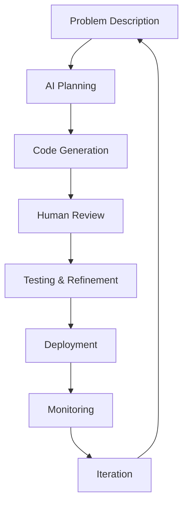

# Slidev Tutorial for Course Instructors

## 🎯 What is Slidev?

Slidev is a presentation slides maker and viewer for developers. It's designed specifically for technical presentations with features that are perfect for coding courses:

- **Markdown-based**: Write slides in simple markdown syntax
- **Code highlighting**: Built-in syntax highlighting for code blocks
- **Interactive elements**: Live code editing, drawings, and recordings
- **Theme support**: Professional, customizable themes
- **Export options**: PDF, PNG, SPA, or even host online
- **Developer tools**: Hot reload, presenter mode, and more

## 🚀 Getting Started with Slidev

### Installation

```bash
# Install Slidev globally
npm install -g @slidev/cli

# Or use with npx (no installation needed)
npx @slidev/cli
```

### Creating Your First Presentation

```bash
# Create a new presentation
npx @slidev/cli new my-presentation

# Or start from existing markdown
npx @slidev/cli slides.md
```

## 📝 Slidev Syntax for Teaching

### Basic Slide Structure

```markdown
---
# slide 1
layout: cover
---

# Course Title
## Subtitle

---

# Regular Slide

Content here

---
layout: two-cols
---

# Two Column Layout

::left::
Left content

::right::
Right content
```

### Teaching-Focused Layouts

#### 1. Cover Layout (Course Introduction)
```markdown
---
layout: cover
background: './images/cover-bg.jpg'
---

# Claude Code Development
## AI-Assisted Programming Mastery

### Module 1: Fundamentals

<div class="pt-12">
  <span @click="$slidev.nav.next" class="px-2 py-1 rounded cursor-pointer hover:bg-white hover:bg-opacity-10">
    Press Space to start <carbon:arrow-right class="inline"/>
  </span>
</div>
```

#### 2. Section Layout (Module Dividers)
```markdown
---
layout: section
---

# JavaScript Fundamentals
## Modern ES6+ with AI Assistance
```

#### 3. Two-Cols Layout (Before/After Examples)
```markdown
---
layout: two-cols
---

# Traditional vs AI-Enhanced

::left::
## Traditional JavaScript
```javascript
function processUsers(users) {
  var result = [];
  for (var i = 0; i < users.length; i++) {
    if (users[i].active) {
      result.push(users[i]);
    }
  }
  return result;
}
```

::right::
## AI-Enhanced JavaScript
```javascript
const processUsers = (users) => 
  users.filter(user => user.active);

// AI suggests further optimization:
const getActiveUsers = (users = []) => 
  users.filter(Boolean).filter(user => user?.active);
```
```

#### 4. Center Layout (Key Concepts)
```markdown
---
layout: center
---

# Key Learning Objective

<div class="text-2xl text-center">
90% Confidence in AI-Assisted Development
</div>

<div class="mt-8">
<v-clicks>

- Master Claude Code integration
- Build production-ready applications
- Implement security best practices
- Deploy scalable solutions

</v-clicks>
</div>
```

### Interactive Teaching Features

#### 1. Click Animations (Progressive Disclosure)
```markdown
---
layout: default
---

# Modern JavaScript Features

<v-clicks>

- **Arrow Functions**: Concise syntax for functions
- **Template Literals**: String interpolation with `${}`
- **Destructuring**: Extract values from objects/arrays
- **Async/Await**: Clean asynchronous code
- **Modules**: Import/export functionality

</v-clicks>

<div v-click="6" class="mt-4 p-4 bg-blue-100 rounded">
💡 AI can help optimize all of these patterns!
</div>
```

#### 2. Code Block Highlighting
```markdown
---
layout: default
---

# AI-Generated API Endpoint

```javascript {1-3|5-10|12-15|all}
// AI-generated Express route
const express = require('express');
const router = express.Router();

// GET /api/users with pagination
router.get('/users', async (req, res) => {
  const { page = 1, limit = 10 } = req.query;
  const users = await User.find()
    .limit(limit * 1)
    .skip((page - 1) * limit);
  
  res.json({
    users,
    pagination: { page, limit, total: await User.countDocuments() }
  });
});
```
```

#### 3. Interactive Diagrams
```markdown
---
layout: default
---

# AI Development Workflow



<div v-click class="mt-4">
<span class="text-orange-500 font-bold">Human expertise remains critical at every step!</span>
</div>
```

#### 4. Live Code Editing
```markdown
---
layout: default
---

# Try It Yourself!

<div class="grid grid-cols-2 gap-4">

<div>

```javascript
// Edit this code live!
const greetUser = (name) => {
  return `Hello, ${name}!`;
};

console.log(greetUser('Student'));
```

</div>

<div v-click>

**Challenge**: Modify the function to:
- Handle missing names
- Add time-based greetings
- Support multiple languages

</div>

</div>
```

### Teaching-Specific Components

#### 1. Learning Objectives Slide
```markdown
---
layout: default
---

# Learning Objectives 🎯

<div class="grid grid-cols-2 gap-8 mt-8">

<div>

## By the end of this module:

<v-clicks>

- **Understand** Claude Code capabilities
- **Apply** prompt engineering techniques  
- **Create** AI-assisted applications
- **Evaluate** code quality and security
- **Integrate** AI into development workflow

</v-clicks>

</div>

<div v-click="6">

## Success Metrics:
- 90% confidence in AI tools
- Complete hands-on exercises
- Build working applications
- Pass module assessment

</div>

</div>
```

#### 2. Code Challenge Slide
```markdown
---
layout: center
---

# 🛠️ Hands-On Challenge

<div class="bg-gradient-to-r from-blue-500 to-purple-600 text-white p-8 rounded-lg">

## Build a Todo API with AI Assistance

**Time**: 30 minutes  
**Tools**: Claude Code + Node.js + Express  
**Goal**: Complete CRUD operations

</div>

<div class="mt-8 grid grid-cols-3 gap-4">

<div v-click="1" class="text-center">
<div class="text-2xl">📋</div>
**Planning**<br>
Use AI for architecture
</div>

<div v-click="2" class="text-center">
<div class="text-2xl">⚡</div>
**Implementation**<br>
AI-generated endpoints
</div>

<div v-click="3" class="text-center">
<div class="text-2xl">🧪</div>
**Testing**<br>
AI test generation
</div>

</div>
```

#### 3. Assessment Slide
```markdown
---
layout: center
---

# 📊 Module Assessment

<div class="grid grid-cols-2 gap-8">

<div>

## Knowledge Check
- 25 questions
- 80% to pass
- Immediate feedback
- Multiple attempts allowed

</div>

<div>

## Practical Demo
- Live coding session
- AI collaboration required
- 15-minute presentation
- Peer evaluation

</div>

</div>

<div v-click class="mt-8 p-4 bg-green-100 rounded">
💡 **Remember**: This course emphasizes learning, not just testing!
</div>
```

## 🎨 Themes and Styling for Education

### Recommended Themes for Technical Education

```yaml
# In your slides.md frontmatter:
---
theme: default # Clean, professional
# theme: apple-basic # Minimalist, modern  
# theme: seriph # Academic, formal
# theme: purplin # Vibrant, engaging
---
```

### Custom CSS for Teaching
```markdown
---
# Add custom styles for education
---

<style>
.learning-objective {
  @apply bg-blue-50 border-l-4 border-blue-500 p-4 my-4;
}

.code-challenge {
  @apply bg-yellow-50 border border-yellow-200 rounded p-4;
}

.tip {
  @apply bg-green-50 border border-green-200 rounded p-4 my-4;
}

.warning {
  @apply bg-red-50 border border-red-200 rounded p-4 my-4;
}
</style>
```

## 🚀 Running Your Slidev Presentation

### Development Mode
```bash
# Start development server with hot reload
npx @slidev/cli slides.md

# Server will run on http://localhost:3030
```

### Presenter Mode
```bash
# Open presenter view (great for teaching!)
# Shows current slide + next slide + notes + timer
# Access via presenter mode button or /?presenter
```

### Export Options
```bash
# Export to PDF
npx @slidev/cli export slides.md

# Export to PNG images
npx @slidev/cli export slides.md --format png

# Build for hosting
npx @slidev/cli build slides.md
```

## 📚 Teaching Best Practices with Slidev

### 1. Progressive Disclosure
Use `v-click` for step-by-step reveals:
```markdown
<v-clicks>

- First concept
- Second concept  
- Third concept

</v-clicks>
```

### 2. Interactive Code Examples
Always include editable code blocks for hands-on learning.

### 3. Visual Hierarchy
Use layouts and styling to guide attention:
- Important concepts: `layout: center`
- Comparisons: `layout: two-cols`
- New sections: `layout: section`

### 4. Engagement Features
- Use click animations to maintain attention
- Include interactive diagrams with Mermaid
- Add challenges and exercises throughout
- Provide immediate feedback opportunities

### 5. Accessibility
- High contrast colors
- Clear, readable fonts
- Logical navigation flow
- Alternative text for images

## 🎯 Integration with Course Materials

### File Structure for Course
```
course/
├── slidev-presentations/
│   ├── module-01-ai-fundamentals.md
│   ├── module-02-foundations.md
│   ├── module-03-javascript.md
│   └── ...
├── package.json (with Slidev dependencies)
└── public/ (shared images and assets)
```

### Package.json Setup
```json
{
  "name": "claude-code-course-slides",
  "scripts": {
    "dev": "slidev",
    "build": "slidev build",
    "export": "slidev export"
  },
  "devDependencies": {
    "@slidev/cli": "^0.47.0",
    "@slidev/theme-default": "^0.47.0"
  }
}
```

This tutorial provides everything you need to create engaging, interactive technical presentations perfect for coding education!